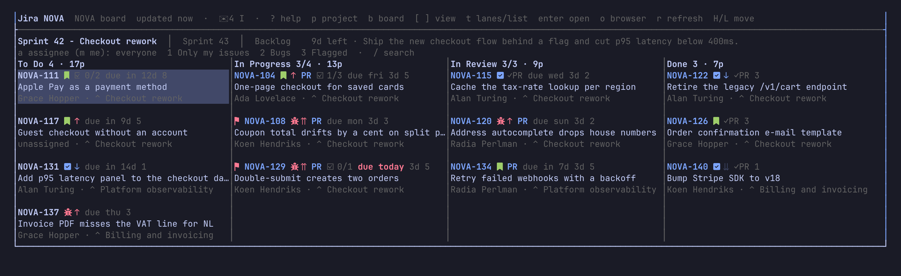
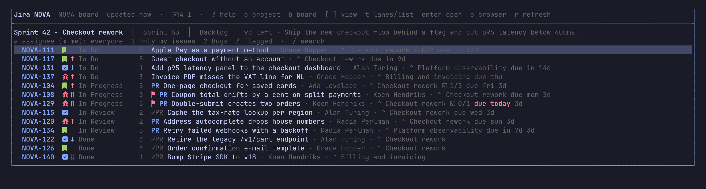
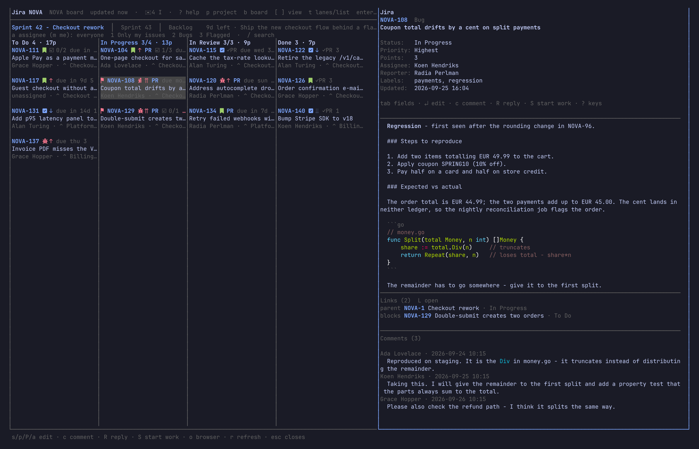
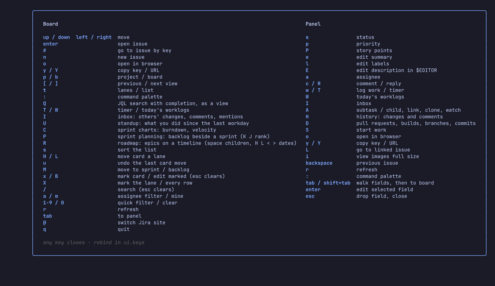
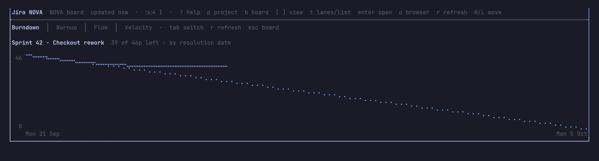
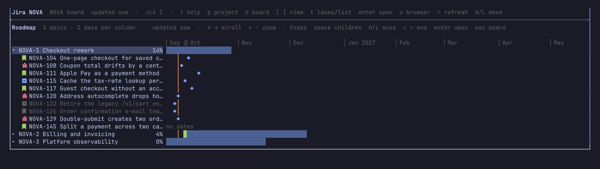

# laneway

A terminal board for Jira. One board of one project as swim lanes or a list,
the selected issue in a panel on the right. Move cards, change status,
priority, points, assignee, summary and labels, comment and reply, all without leaving the
terminal.



- Swim lanes or a sortable list, with drag and drop between lanes
- Sprints, backlog and kanban boards; the board's quick filters plus your own
- Local search, "only mine", jump to any issue by key
- Issue panel with description, comments, links, subtasks and attachments
- Inline images in kitty and Ghostty
- Idle auto-refresh, cached boards for instant startup
- Every key and colour configurable

`t` swaps the lanes for a sortable list:



`enter` opens the issue beside the board: fields, description, links and the
comment thread.



## Install

```sh
go install github.com/cornedor/laneway@latest
```

Or grab a binary from [Releases](https://github.com/cornedor/laneway/releases).

## Config

`~/.config/laneway/config.yaml`:

```yaml
jira:
  base_url: https://your-instance.atlassian.net
  email: you@example.com
  api_token: ...          # or JIRA_API_TOKEN
  projects: [ABC]         # listed first in the project picker
  repos: {ABC: ~/src/abc} # for S (start work in a herdr worktree)
sites:                    # more Jira instances: laneway -site club, or @ in the app
  club: {base_url: https://club.atlassian.net, email: you@example.com, api_token: ...}
```

Create a token at <https://id.atlassian.com/manage-profile/security/api-tokens>.
laneway only reads your Jira until you act: moving a card, editing a field or
commenting.

The optional `ui:` section (defaults shown):

```yaml
ui:
  auto_refresh: 2m   # idle board refetch; "off" disables
  stale_after: 1m    # older boards refetch on focus/tick
  images: auto       # kitty/Ghostty inline images; "off"
  image_max_rows: 16
  panel_width: 50    # issue panel, percent of the width
  card_limit: 500    # most cards one view fetches (50–5000)
  default_mode: lanes           # or list; the last used mode wins after that
  date_format: 2006-01-02 15:04 # Go time layout
  card_fields: [type, priority, status, points, assignee, parent, pr, subtasks, due, flagged, age]
  quick_filters:                # JQL presets before the board's own (1-9)
    - {name: Bugs, jql: "type = Bug"}
  views:                        # extra views of every board, after its own ([ ])
    - {name: Mine, jql: "assignee = currentUser()"}
  capacity: {Ada: 13, default: 10}   # sprint points per person, for P planning
  timer_on_start: on            # S (start work) also starts the timer (off)
  velocity_sprints: 8           # closed sprints in C's velocity chart
  stale_days: 5                 # an in-progress card's age turns red past this
  templates:                    # a new issue's description by type (markdown)
    Bug: "## Steps\n\n1. \n\n## Expected\n\n## Actual"
  saved_filters: on             # your starred Jira filters as views too (off)
  keys:              # rebind any action: one key or a list
    search: f
    mine: [m, M]
  theme:             # colours: ANSI 0–255 or #rrggbb
    preset: tokyonight  # or catppuccin, gruvbox; `theme: gruvbox` alone works too
    accent: "#7aa2f7"
    dim: "244"
```

A bad value keeps its default and is reported on the status line, as is a key
bound to two actions on the board or in the panel.

Actions: up down left right top bottom page_up page_down open toggle_panel
browser refresh quit help search goto copy_key copy_url move_left move_right
create project board next_view prev_view toggle_mode sort move_sprint assignee_filter mine
clear_filters · panel: status priority points summary labels assign comment reply start_work
linked_issue back image.

Colours: accent dim selection_fg selection_bg selection_idle error mention link
code attachment over_limit drop_fg priority_highest priority_high priority_low
priority_lowest type_bug type_story type_epic type_subtask type_other
highlight roadmap_done roadmap_todo.

### Rules

Top-level `rules:` fire on what a board refresh shows changed since the last
refresh of the same view and filters: a new issue, or a status, assignee,
priority, points or summary change, yours included unless `by_me: false`.

```yaml
rules:
  - name: done-bugs
    on: status                  # new status assignee priority points summary; default all
    match:                      # all must hold; globs, case-insensitive, one or a list
      type: Bug
      status: [Done, "Won*"]
      from_status: "In *"
      by_me: false              # skip your own edits (reads the issue's changelog)
      # key, assignee ("none" = unassigned), priority, summary (regexp), not: {…}
    actions:
      - type: log               # appends to ~/.config/laneway/rules.log
        text: "{{.Key}} {{.OldStatus}} → {{.Status}}"   # empty: a default line
      - type: notify            # desktop notification via the terminal (OSC 777:
        title: "{{.Key}} done"  # kitty, Ghostty, WezTerm, foot)
      - type: exec              # argv; the issue as JSON on stdin and LANEWAY_*
        command: [notify-send, "{{.Key}}", "{{.Summary}}"]   # env; 30s timeout
      - type: highlight         # a ● on the card until you open it
        color: "#e0af68"        # optional, else the theme's highlight
      - type: transition        # move the issue along its workflow
        to: Closed
      - type: comment           # post a comment
        text: "Closed after {{.OldStatus}}"
```

`transition` and `comment` write to Jira, so they fire only on a change the
issue's changelog shows someone else made: never on yours, and never on
their own writes coming back on the next refresh. A transition to the
status the issue has does nothing; one its workflow doesn't offer is logged.
`laneway rules test -by-me=false` shows them firing.

A rule with `watch:` fires on the changes of its own JQL search instead,
polled every `every:` (default 5m, at least 1m) while laneway runs, whichever
board is open. `laneway rules watch` polls them without the board, printing
what fires; `highlight` is skipped there and `notify` needs a terminal:

```yaml
  - name: mine-moved
    watch: assignee = currentUser() AND updated >= -1d
    every: 2m
    on: status
    actions: [{type: notify}]
  - name: stuck-in-review       # a time trigger: an issue enters the search
    watch: status = "In review" AND NOT status CHANGED AFTER -3d
    every: 1h
    on: new                     # issues already in it at start are the baseline
    actions: [{type: log, text: "{{.Key}} in review 3 days"}]
```

Template fields: Kind Key Summary Type Status Assignee Priority Points Parent
OldStatus OldAssignee OldPriority OldPoints Describe.

A bad rule is skipped and reported on the status line. `laneway rules list`
shows what loaded; `laneway rules test -on status -type Bug -status Done
-from-status "In review"` (`-watch JQL` for a watch rule) says which rules
that change fires and what stopped the rest, without running anything. A matterbox config's `rules:` are ignored.

State (last project, board, view, filters, cached boards) lives in
`~/.config/laneway/state.json`. An existing `~/.config/jiratui` or matterbox
config is picked up as a fallback.

## Keys



`?` shows every key as bound. `:` opens the command palette: every action
of the focused pane, the board's views, quick filters and boards, the
loaded issues and the ones you opened lately, filtered by every word you type. From three characters it
also searches all of Jira (summary, description, comments); those hits come
last, marked `⌕`.

Board:
- move: arrows or `hjkl` · `enter` open · `tab` panel · `#` go to key · `/` search
- board: `p` project · `b` board · `[` `]` view · `t` lanes/list · `s` sort list (by assignee, priority or epic it groups) ·
  `a` assignee · `m` mine · `1-9` quick filters · `0` clear · `r` refresh · `@` site
- cards: `H`/`L` move a lane · `u` undo the last move · `M` to sprint/backlog · `n` new issue · `x`/`X`
  mark · `B` edit marked · `o` browser · `y`/`Y` copy key/URL (list with marks: `y` copies them as a markdown table) · drag with the mouse
- views: `Q` JQL search · `R` roadmap · `P` planning · `C` charts
- you: `I` inbox · `U` standup · `T` timer · `W` today's worklogs
- `q` quit

Panel:
- fields: `tab`/`shift+tab` walk them (custom ones too), `enter` edits one;
  dates take `2026-10-01`, `today`, `+3d`, `fri`; date-times `fri 14:00`; the
  parent an issue key; the sprint a pick of the board's
- edit: `s` status · `p` priority · `P` points · `e` summary · `E` description in
  `$EDITOR` · `l` labels · `a` assignee
- talk: `c` comment · `R` reply · `w` log work · `T` timer
- more: `A` subtask / link / unlink / clone / watch / vote / flag / upload / paste image / download · `H` history ·
  `D` pull requests / builds / deployments / branches / commits · `L` linked issue · `i` images full size (← →)
- `backspace` previous issue · `S` start work · `o` browser · `y`/`Y` copy ·
  `r` refresh · `esc` drop field, close

## Bulk edit

`x` marks the card under the cursor (marks survive switching views), `X`
the whole lane or every shown row (`/` narrows it), `B`
changes every marked card: status (each along its own workflow move; when
the move needs fields, the form asks them once for all), priority, assignee, labels (`ui -old` adds ui, removes
old), story points, or sprint. Cards that fail stay marked with the reason
in the status bar. `esc` clears the marks.

## Descriptions

`E` in the panel opens the description as markdown in `$VISUAL` or
`$EDITOR` (else `vi`); saving a changed file writes it back. Paragraphs,
headings, lists, code, quotes, rules and bold / italic / code / strike /
links are text to edit. A mention, emoji, date or status inside text
stands as `⟦2 @Ada⟧`: edit around it, delete it to drop it. A block
markdown can't keep as it is — a table, an image or a stray `*` — stands as
a `<!-- keep:1 table … -->` line: move it and the block moves, delete it
and the block goes, anything else and it comes back untouched. Your own
comments edit the same way from `A` → Edit a comment.

In the `c` composer, `@` and a few letters list matching users;
`ctrl+n`/`ctrl+p` pick, `tab` inserts a mention that notifies them.

## Inbox

`I` lists what others did since you last opened it (a day, the first
time) on the issues you watch, are assigned or reported: field changes and
comments, those mentioning you first and marked `@`. Filter by typing;
`enter` opens the issue. The header shows `✉ 3` when issues of yours were
changed by others since (checked every 5 minutes); a new mention of you
also raises a desktop notification (OSC 777: kitty, Ghostty, WezTerm, foot).

## Standup

`U` lists what you did since the previous workday (Friday on a Monday), by
day: status and field changes, comments and logged work. Its first row,
Copy as text, puts it on the clipboard grouped per issue, ready to paste.
`U` again reaches a workday further back.

## Time tracking

`w` in the panel logs work: `1h 30m what you did` (also `1.5h`, `45m`,
`2d` of 8h), ending now. `T` starts a timer on the card or panel issue,
shown in the header and kept across restarts; `T` again stops it into the
same input, filled with the time and started when the timer did. `W` lists
what you logged today with the day's total; `[` `]` step a day, `e` edits
an entry's time and comment, `d` twice deletes it, `enter` opens the issue.

## Planning

`P` on a scrum board shows the backlog beside a sprint (the first future
one; `[` `]` pick another), each with its card count and points, the sprint
also per assignee, against `ui.capacity` (red when over). `← →` switch side,
`x` marks cards, `M` or `space` moves the marked (or the selected) across,
`K`/`J` rank it up or down. `S` starts the sprint on the right (today until
the day you type, `+2w` by default), or moves an active one's end; `R`
renames it; `C` twice completes the active one,
moving its unfinished issues (not in the board's last column) to the next
planned sprint, else the backlog. `N` creates a sprint, named on from the
last one; `E` edits the goal of the one on the right. Changes show at once and are written behind;
a failed write reloads both sides.

## Charts



`C` on a scrum board: the active sprint's burndown (points left per day by
resolution date, against the dotted ideal), its burnup (points done against
the scope, dotted), its cumulative flow (issues per board column, day by
day) and the velocity of the last 8 closed sprints
(`ui.velocity_sprints`); `tab` steps through them (points done by the sprint's end over points in
it). The burndown counts an issue from the day it joined the sprint and
says how much was added after the start; issues taken out of it don't show.

## JQL search

`Q` opens a JQL input that completes fields, functions and keywords, and a
field's values after an operator (`tab` takes one, `↑↓` choose); `enter`
shows the results as a view. An empty input offers your past searches.
`ctrl+s` stars the query as a view on every board (`★ …`, kept in the
state file); `ctrl+s` on a starred one unstars it.

## Roadmap



`R` on the board shows the project's epics on a timeline: open ones and
those done in the last 90 days, in rank order. A bar runs from the epic's
Start date (or Plans' Target start) to its Due date (or Target end); an
epic without them spans its children's sprints, drawn fainter. The bar
fills by points done, else by children done. `← →` scroll, `+ -` zoom
(day to 2 weeks per column), `.` back to today, `space` folds out the
epic's issues, `enter` opens the row's issue, `esc` back to the board.
`H`/`L` move a bar (an epic's or a child's) a column, `<`/`>` move its end;
the dates are written to Jira once you pause. `f` shows the epic's issues as
a board view, `n` makes a new epic. An epic an open epic blocks shows `⛓`, red `⛔` when
that blocker ends after it starts. Epics with a parent (an initiative)
sit under it; the parent's faint bar spans its epics, `space` folds it.

## Images

In kitty or Ghostty, images embedded in an issue's description and comments
are drawn inline in the panel; `i` shows them full size. Inside tmux they
need `set -g allow-passthrough on`. Elsewhere they show as a caption.
`ui.images: off` or `LANEWAY_IMAGES=0` turns them off.

## Build

`make` · `make test` · `make install`. See [CONTRIBUTING.md](CONTRIBUTING.md).

## License

[MIT](LICENSE)
