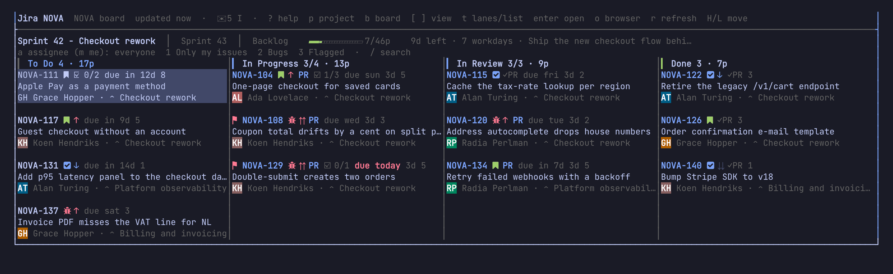
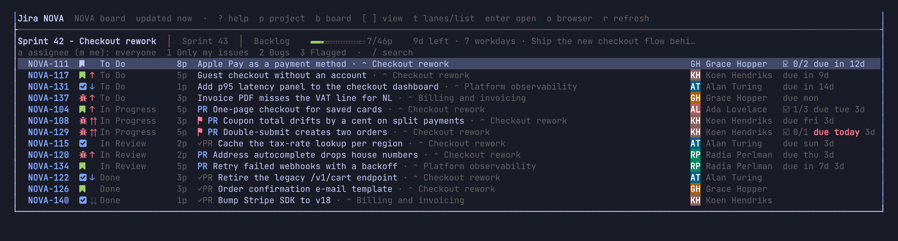
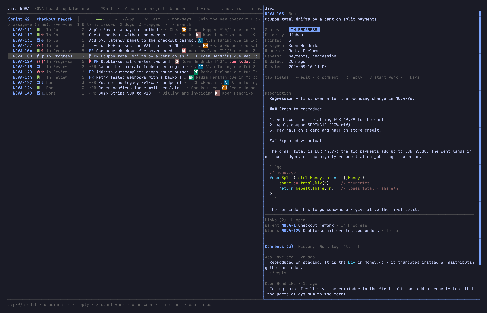
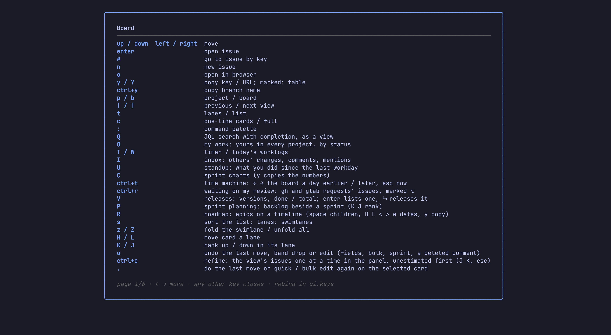

# laneway

A terminal board for Jira. One board of one project as swim lanes or a list,
the selected issue in a panel on the right. Move cards, change status,
priority, points, assignee, summary and labels, comment and reply, all without leaving the
terminal.



- Swim lanes or a sortable list, with drag and drop between lanes and to rank
- Sprints, backlog and kanban boards; the board's quick filters plus your own
- Local search, JQL with completion, a command palette, jump to any issue by key
- Issue panel with description (edited as markdown), comments, links, subtasks, an epic's children, attachments and private notes; ask an LLM command about it
- Sprint planning and refinement; burndown, velocity, cycle time and retro charts; an epic roadmap; releases; the board replayed day by day
- Time tracking: log work, a timer, the day's and the week's worklogs, proposals from git and your agents' activity
- Inbox: a thread per issue others changed, on every site, each read, done or snoozed on its own; a standup of yours (commits too), or your team's walking the board
- Git: branch keys in commits, draft pull requests, what waits on your review, a prompt segment
- Coding agents: start one on an issue in its own worktree (herdr), see its state on the card, attach to it
- Rules that notify, run a command or act on Jira when issues change
- Scripts: list, view, create and move from the shell, completion, your own actions on a key
- Several Jira sites, inline images in kitty and Ghostty; a local index of what you read, searchable offline; changes made offline sent later
- Every key and colour configurable

`t` swaps the lanes for a sortable list:



`enter` opens the issue beside the board: fields, description, links and the
comment thread.



New here? `laneway -demo` (or `demo` at the first start's site prompt) opens a generated board, no Jira needed. The
[guide](https://cornedor.github.io/laneway/guide/) walks you through it step by step
([source](docs/guide/README.md)).

## Install

```sh
brew install cornedor/tap/laneway      # macOS
yay -S laneway                         # Arch (AUR), laneway-git for main
nix run github:cornedor/laneway
go install github.com/cornedor/laneway@latest
```

Or grab a binary from [Releases](https://github.com/cornedor/laneway/releases).

`laneway -demo` runs on a generated project (sprints, comments, worklogs)
served in-process: nothing of yours is read or written, and what you change
is gone when it ends.

Once a day laneway looks for a newer release; one shows as `↑ v1.2` in the
header, and the palette (`:`) has its upgrade command. `ui.update_check: off`
stops it.

## Config

The first `laneway` asks for your Jira (`acme` or its URL), email and an
[API token](https://id.atlassian.com/manage-profile/security/api-tokens), signs
in to check them and writes the config, readable only by you. `laneway setup` (or `@` → *add a Jira
site* in the app) adds another under `sites:`; given a URL already there, it
replaces that site's email and token (an expired token). Where there is a
keyring (`secret-tool`, macOS Keychain) it offers to keep the token there,
writing only the command that reads it back. Comments in the file are kept.

`~/.config/laneway/config.yaml`:

```yaml
jira:
  base_url: https://your-instance.atlassian.net
  email: you@example.com
  api_token: ...          # or JIRA_API_TOKEN, or:
  # api_token_cmd: [secret-tool, lookup, service, laneway]   # prints the token (pass, op read, …)
  projects: [ABC]         # listed first in the project picker
  repos: {ABC: ~/src/abc} # for S (start work in a herdr worktree), and your commits in U
  start_statuses: {ABC: Doing} # S moves ABC issues there, over ui.start_status ("" for none)
  timeout: 20s            # one request's limit (an attachment's: without progress); longer actions stretch with it
  story_points_field: customfield_10016  # else found by name ("Story point…")
  start_prompt: "Start on {key}."        # what S hands the agent; {key} is the issue; none: no prompt
sites:                    # more Jira instances: laneway -site club, or @ in the app (remembered)
  club: {base_url: https://club.atlassian.net, email: you@example.com, api_token: ...}
```

Create a token at <https://id.atlassian.com/manage-profile/security/api-tokens>.
laneway only reads your Jira until you act: moving a card, editing a field or
commenting.

The optional `ui:` section (defaults shown):

```yaml
ui:
  auto_refresh: 2m   # idle board refetch; "off" disables
  stale_after: 1m    # older boards refetch on focus/tick
  images: auto       # kitty/Ghostty inline images and avatar chips (cached in ~/.cache/laneway/avatars); "off"
  image_max_rows: 16
  panel_width: 50    # issue panel, percent of the width; drag its left border or < > to resize, remembered (near this it snaps back and forgets)
  card_limit: 500    # most cards one view fetches (50–5000); charts and the roadmap count up to 5000
  default_mode: lanes           # or list; the last used mode wins after that
  date_format: 2006-01-02 15:04 # Go time layout; the panel says 2d ago within a week
  card_fields: [type, priority, status, points, assignee, avatar, parent, pr, deploy, subtasks, due, flagged, age]
  quick_filters:                # JQL presets before the board's own (1-9)
    - {name: Bugs, jql: "type = Bug"}
  views:                        # extra views of every board, after its own ([ ])
    - {name: Mine, jql: "assignee = currentUser()"}
  card_colors: ribbon           # the board's own card colours as a bar on cards and rows; off
  mouse: on                     # clicks, drags and the wheel; off leaves the mouse to the terminal
  activity: [~/bin/claude-activity]  # p in W: commands printing "time<TAB>key" lines of a day's work
  llm: claude -p                # ctrl+a's command: the question last, the issue on stdin (llm, ollama run llama3, …)
  delight: on                   # small celebrations: confetti on a card into done, a sprint's points against the last ones; off
  skin_tone: medium             # : completion's tone for people: light, medium_light, medium, medium_dark, dark
  update_check: on              # a daily look for a newer release, ↑ in the header; off
  double_click: 400ms           # how quickly a second click opens (100ms–2s)
  icons: nerd                   # issue type glyphs need a Nerd Font; plain draws letters (B S E ↳ •)
  empty_fields: show            # hide folds the panel's empty fields behind a row (a click or : shows them)
  custom_fields: [Test type, Team]   # Jira fields by name on cards and rows, searchable
  filters:                      # named / queries, recalled from the : palette
    - {name: Stale review, query: "status:review age>3d"}
  capacity: {Ada: 13, default: 10}   # sprint points per person, for P planning
  timer_on_start: on            # S (start work) also starts the timer (off)
  start_assigns: on             # S also assigns the issue to you (off)
  start_status: In Progress     # and moves it there, unless the move has a screen (none)
  workday_start: "09:00"        # when work logged on another day starts
  velocity_sprints: 8           # closed sprints in C's velocity chart
  stale_days: 5                 # an in-progress card's age turns red past this
  templates:                    # a new issue's description by type (markdown)
    Bug: "## Steps\n\n1. \n\n## Expected\n\n## Actual"
  saved_filters: off            # your starred Jira filters as views too (on)
  branch_template: "{key}-{summary}"  # ctrl+y's branch name: {key} {summary} {type} {project}
  work_branch_template: "issue/{key}-{summary}"  # S's new branch; default branch_template when set
  kanban_done_days: 14          # done work older than this leaves kanban boards
  roadmap_epic_type: Epic       # the issue type R shows and n creates (Initiative, …)
  download_dir: ~/Downloads/jira  # where attachments are saved ($XDG_DOWNLOAD_DIR, else ~/Downloads)
  my_work_jql: "assignee = currentUser() AND statusCategory != Done"   # O's query; default: yours everywhere, open or done this week
  roadmap_done_days: 90         # resolved epics older than this leave the roadmap
  workdays: [mon, tue, wed, thu, fri]  # standup (U) looks back to the previous one
  inbox_every: 5m               # inbox sync, for the header's ✉ count; "off"
  inbox_lookback: 168h          # how far back the inbox reaches
  inbox_issues: 30              # recently updated issues the inbox and standup read
  timer_round: 15m              # T's logged time rounded up to this (to the minute)
  clipboard_image: wl-paste --type image/png  # prints the clipboard's PNG (probed by default)
  open: wslview                 # opens URLs and attachments (xdg-open / open by default)
  full_refresh: 10m             # idle refreshes fetch changes only, whole again after this
  flag_value: Impediment        # the Flagged option A → flag sets
  work_agent: claude            # the herdr agent S offers first
  agent_view: panel             # an attached agent in the panel; fullscreen (default) hands it the screen
  work_args: [--append-system-prompt, "User is working on {key}"]  # its arguments before the prompt
  work_create: [wt, switch, --create, "{branch}", --base, "{base}", --no-cd]  # makes a missing worktree; unset: herdr
  code_theme: monokai           # chroma style for code blocks; default follows theme's preset
  keys:              # rebind any action: one key or a list
    search: f
    mine: [m, M]
  theme:             # colours: ANSI 0–255 or #rrggbb
    preset: tokyonight  # or catppuccin, gruvbox; `theme: gruvbox` alone works too
    accent: "#7aa2f7"
    dim: "244"
```

`,` lists every `ui:` option with its value and default; `enter` edits a one-line
one (empty for the default; `tab`, `↑` or `↓` save it and move on), checked, written back to the file (comments kept)
and applied at once (`images`, `image_max_rows`, `card_limit`, `default_mode`,
`flag_value`, `inbox_issues` after a restart). An option with a fixed set
(`icons`, `mouse`, `theme`, `code_theme`, …) picks from its values instead,
the current one ✓; the selected row says what it does, and one that holds
more than a line (`templates`, `views`, `keys`) shows its whole value.

A bad value keeps its default and is reported on the status line, as is a key
bound to two actions on one screen (board, panel, planning, roadmap, charts,
timesheet).

Actions for `keys:`, by where they first apply:

- board: up down left right top bottom page_up page_down open toggle_panel
  browser refresh quit help search goto create copy_key copy_url copy_branch
  move_left move_right rank_up rank_down rank_top rank_bottom project board next_view prev_view
  toggle_mode sort fold unfold_all compact move_sprint assignee_filter mine
  clear_filters mark mark_all undo bulk quick_edit pin palette jql
  filter_builder my_work review roadmap plan charts releases timer timesheet
  inbox agents standup site settings panel_wider panel_narrower
- panel: status priority points summary labels assign description comment
  reply log_work start_work linked_issue back image issue_actions history
  development next_comment prev_comment delete_comment
- planning: plan_start plan_goal plan_rename plan_new plan_complete
- roadmap: roadmap_grip roadmap_fold end_earlier end_later zoom_in zoom_out
  today roadmap_issues
- timesheet: edit_entry delete_entry propose_work
- inbox: inbox_done inbox_done_all inbox_unread inbox_snooze
- agents: agent_prompt agent_stop

Colours: accent dim selection_fg selection_bg selection_idle error mention link
code attachment over_limit drop_fg priority_highest priority_high priority_low
priority_lowest type_bug type_story type_epic type_subtask type_other
highlight roadmap_done roadmap_todo, status_todo status_progress status_done
(lane marks and the panel's status lozenges, on drop_fg; unset they follow dim,
roadmap_todo and roadmap_done), and shade: `auto` (steps off the terminal's own background: faint for
the canvas around the cards and list zebra rows, stronger for the panel's trail
and section bars), `off`, or one colour for all. On a light terminal the
default selection_idle turns light grey (`253`); the presets are for dark ones.
`theme: mono` (or `NO_COLOR` set) draws no colour at all: the cursor and a
drop in reverse, the accent bold, the dim faint.

### Actions

`ui.actions` are your own commands on an issue: each is in the palette (`:`),
and on its key when it has one no built-in uses. It runs with the selected
issue (in the panel, the panel's; on the board, the marked cards when there
are) as JSON on stdin, `LANEWAY_KEY` and `LANEWAY_KEYS` in the environment.
The output's last line shows on the status line, or all of it with
`show: pager`; `refresh: true` reloads the board and issue after.

```yaml
ui:
  actions:
    - {name: open in my notes, key: "!", command: [sh, -c, 'obsidian "jira/$LANEWAY_KEY"']}
    - {name: estimate, command: [./estimate.sh], where: panel, show: pager, refresh: true}
```

### Rules

Top-level `rules:` fire on what a board refresh shows changed since the last
refresh of the same view and filters: a new issue, or a status, assignee,
priority, points or summary change, yours included unless `by_me: false`.

```yaml
rules:
  - name: done-bugs
    on: status                  # new status assignee priority points summary; default all
    match:                      # all must hold; globs, case-insensitive, one or a list
      type: Bug
      status: [Done, "Won*"]
      from_status: "In *"
      by_me: false              # skip your own edits (reads the issue's changelog)
      # key, assignee ("none" = unassigned), priority, summary (regexp), not: {…}
    actions:
      - type: log               # appends to ~/.config/laneway/rules.log
        text: "{{.Key}} {{.OldStatus}} → {{.Status}}"   # empty: a default line
      - type: notify            # desktop notification via the terminal (OSC 777:
        title: "{{.Key}} done"  # kitty, Ghostty, WezTerm, foot)
      - type: exec              # argv; the issue as JSON on stdin and LANEWAY_*
        command: [notify-send, "{{.Key}}", "{{.Summary}}"]   # env; 30s timeout
      - type: highlight         # a ● on the card until you open it
        color: "#e0af68"        # optional, else the theme's highlight
      - type: transition        # move the issue along its workflow
        to: Closed
      - type: comment           # post a comment
        text: "Closed after {{.OldStatus}}"
```

`transition` and `comment` write to Jira, so they fire only on a change the
issue's changelog shows someone else made: never on yours, and never on
their own writes coming back on the next refresh. A transition to the
status the issue has does nothing; one its workflow doesn't offer is logged.
`laneway rules test -by-me=false` shows them firing.

A rule with `watch:` fires on the changes of its own JQL search instead,
polled every `every:` (default 5m, at least 1m) while laneway runs, whichever
board is open. `laneway rules watch` polls them without the board, printing
what fires; `highlight` is skipped there and `notify` needs a terminal:

```yaml
  - name: mine-moved
    watch: assignee = currentUser() AND updated >= -1d
    every: 2m
    on: status
    actions: [{type: notify}]
  - name: stuck-in-review       # a time trigger: an issue enters the search
    watch: status = "In review" AND NOT status CHANGED AFTER -3d
    every: 1h
    on: new                     # issues already in it at start are the baseline
    actions: [{type: log, text: "{{.Key}} in review 3 days"}]
```

Template fields: Kind Key Summary Type Status Assignee Priority Points Parent
OldStatus OldAssignee OldPriority OldPoints Describe.

`laneway rules watch`, `list` and `test` take `-site club` to use a `sites:`
entry instead of `jira:`.

A bad rule is skipped and reported on the status line. `laneway rules list`
shows what loaded; `laneway rules test -on status -type Bug -status Done
-from-status "In review"` (`-watch JQL` for a watch rule) says which rules
that change fires and what stopped the rest, without running anything.
Left out, `-type` and `-status` come from the project (the `-key`'s, else
the first of `jira.projects`): its Task, else first type, and that type's
first to-do status; `rules_test: {type: Story, status: Backlog}` overrides
them, and without Jira they are Task and To Do. A matterbox config's
`rules:` are ignored.

State (last project, board, view, filters, cached boards) lives in
`~/.config/laneway/state.json`, and `state-club.json` for a site. An existing `~/.config/jiratui` or matterbox
config is picked up as a fallback.

Every issue laneway reads (boards, searches, the panel) is mirrored in
`~/.cache/laneway/index-jira.db`, `index-club.db` for a site. `laneway index`
shows what it holds, `laneway index clear` drops it. Offline, the palette
and the panel answer from it and say so, and so does a `Q` search for its
`AND`ed project, key, status, type, priority, assignee, statusCategory and
`text ~` clauses, naming the ones it left out.

It keeps each project's people too: everyone assignable, read in full once
a week, and whoever laneway sees on issues meanwhile. `@` mentions and the
person pickers answer from it at once, offline too; a name it lacks is
still searched in Jira.

## Keys



`?` shows every key as bound, and the mouse, paged to the screen's width (`←` `→`; from the panel it opens at the panel's keys). `:` opens the command palette: every action
of the focused pane, the board's views, quick filters and boards, the
loaded issues and the ones you opened lately, filtered by every word you type. From three characters it
also searches all of Jira (summary, description, comments) and the index
(below); those hits come last, marked `⌕`, the index's with when they were read. Actions match common words too (`create`, `transition`,
`worklog`). Over the roadmap, planning or charts it lists that screen's
actions only. Its `messages` row lists the status line's last messages
with their time (the line shows one, cut to the screen; a notice leaves after 8s, an error stays); `enter` copies one.

Started in a git branch named after an issue (`issue/ABC-12-fix`), laneway
opens that issue; the header's `⎇ ABC-12` and the palette's first row open
it again.

Board:
- move: arrows or `hjkl` · `enter` open · `tab` panel · `#` go to key · `/` search · `F` filter builder (field, compare and value columns side by side, typing narrows the one with the cursor, `enter` adds the term to the `/` query and stays for the next, `ctrl+x` drops the last; the terms show as header chips, a click removes one)
- board: `p` project · `b` board · `[` `]` view · `t` lanes/list · `s` sort list (rank, priority, points, assignee, epic, key, status, updated, due, created; by assignee, priority, epic or status it groups), in lanes swimlanes by assignee / epic / priority (kept per board; a drop into another band assigns it; `z` folds a band, `Z` unfolds all) ·
  `a` assignee · `m` mine · `1-9` quick filters · `0` clear · `r` refresh · `@` site
- cards: `H`/`L` move a lane (in the list, to the board's previous / next column) · `K`/`J` rank in its lane (or a list by rank), `alt+k`/`alt+j` to its top / bottom, or drag it there · `u` undo the last change, again the one before (up to 50): a move, a rank, a band drop, a field, quick or bulk edit, a sprint move or a deleted comment (also in the panel) · `.` does the last move or quick / bulk edit again on the selected card · `M` to sprint/backlog · `n` new issue (see [New issues](#new-issues)) · `x`/`X`
  mark · `B` edit marked · `e` quick edit the card (status, priority, assignee, labels, points, sprint) · `*` pin (★) · `o` browser · `y`/`Y` copy key/URL (list with marks: `y` copies them as a markdown table) · `ctrl+y` copy branch name
- views: `Q` JQL search · `O` my work (assigned to you in every project, open or done this week, by status) · `ctrl+r` waiting on my review (see [Git](#git-and-your-shell)) · `R` roadmap · `P` planning · `C` charts · `V` releases · `ctrl+t` time machine: `←` `→` replay the lanes a day at a time from the status changelog (cards made later drop out; from the list it shows lanes), `esc` back to now · `ctrl+o` a closed sprint as it closed: done, and what carried over to which sprint
- refine: `ctrl+e` steps through the view's open issues (done ones skipped) one at a time in a wide panel, the unestimated first, to set points, priority, labels, status or split them (`A`): `J` next, `K` back, `esc` ends and copies what changed as a list
- you: `I` inbox · `ctrl+g` agents · `U` standup (`tab` the team's) · `T` timer · `W` today's worklogs (`W` again: the week)
- mouse: a click selects, a second opens; drag a card to another lane, or up and down its own to rank it; it lands where its ghost shows, in a lane of one status with the swimlanes off (`esc` cancels a drag, anywhere); a band's header folds it. Most of the header clicks: views, filters, chips, key hints, the timer, `✉`, the sprint bar opens the charts. What a click would act on is underlined under the pointer, which turns to a hand (where the terminal draws pointer shapes; in tmux with `allow-passthrough`)
- right-click a card or row: its menu at the pointer, as big as its rows: status, priority, assignee and sprint open their list beside it (`→` or a click; `esc` or `←` back), labels and points ask, and open, browser, copy key and pin do what their key does. The row under the pointer is the chosen one; a click off the menu closes it
- `q` quit; on the roadmap, planning, charts, the standup or the week it closes them (asks once while writes are still sending or you have an unsaved edit or comment)

Panel:
- fields: `tab`/`shift+tab` walk them (custom ones too), `enter` edits one;
  text, number and date fields edit in their row, status, priority, assignee, reporter
  and option fields drop a list under it;
  dates take `2026-10-01`, `today`, `+3d`, `fri`; date-times `fri 14:00`; the
  parent an issue key; the sprint a pick of the board's
- edit: `s` status · `p` priority · `P` points · `e` summary · `E` description · `l` labels (existing ones suggested as you type: `↓` `tab`; custom labels fields and form rows too) · `a` assignee
- talk: `c` comment (composed after the thread, `ctrl+s` posts) · `R` reply (under its comment) · `}` / `{` select a comment: `R` replies to it, `enter` edits your own (replies to others'), `delete` twice deletes it, `esc` lets go · `w` log work · `T` timer
- ask: `ctrl+a` pipes the issue, its comments and history to `ui.llm` (default `claude -p` when on the PATH) to summarise the thread, draft acceptance criteria, split it into subtasks or suggest points; the answer opens in the comment composer, posted only on `ctrl+s`
- notes: `N` opens private notes in `$EDITOR`, a plain file beside the state file (`notes/ABC-12.md`, `notes-<site>/` for another site); the panel shows them folded, `is:notes` finds them, `A` posts them as a comment
- activity: `[`/`]` (or a click) switch its tabs: comments · history · work log · all
- more: `A` holds the rest — new: subtask or epic child, clone · links: to an issue (a key or words find it as you type; the picked one shows its type, status and assignee to confirm), a web page, remove one · the issue: change its type, move it to another project, set the original estimate, time in each status, the dependency tree (blockers of blockers, and what it holds up), delete it (`enter` twice; subtasks too) · people: watch, add or remove watchers, vote · flag · files: upload, paste an image, screenshot a region (grim + slurp, gnome-screenshot, spectacle or screencapture), download or delete an attachment · your comments: edit, delete · post your notes · a draft pull request (see [Git](#git-and-your-shell))
- `H` history ·
  `D` pull requests / builds / deployments / branches / commits · `*` pin (first in the palette) · `L` linked issue, epic child or web link (Confluence pages, specs) · `i` images full size (← →, or click either half or the wheel; a click below goes back)
- mouse: drag over the panel's text (description, comments, fields) to select it, and letting go copies it; drag the panel's left border to resize it, the scrollbar to scroll; a click selects a field, a second edits it; links, activity tabs, images and key hints click, a comment's byline replies to it, the row under it replies, edits or deletes (yours; delete clicks twice), `E edit` on the Description heading edits it (`E add one` with none; a double-click on the heading too), an agent's row attaches to it. In pickers and forms a click picks and a click outside cancels (a composer keeps its text); the wheel scrolls
- `/` find in the issue, `n`/`N` the next / previous hit (what the panel shows: the open activity tab, `all` for everything)
- `backspace` (or a click on a ↰ strip) back to the issue a link came from · `S` start work · `o` browser · `y`/`Y` copy ·
  `r` refresh · `esc` drop field, close

Offline, a change to an issue that never reached Jira (no connection) is
kept in the state file, `⇡3` in the header, and sent every 30 seconds
until Jira answers, oldest first. If the issue changed in Jira meanwhile
it waits: the palette's *queue* row sends it anyway or drops it. Anything
that may have reached Jira fails as before, so nothing is sent twice.

## Search and filters

`/` narrows the loaded cards (lanes and list) as you type, without a refetch.
Every term must hold:

```
login                text in key, summary, assignee or epic ("log in" a phrase)
status:review,test   a field containing any of the values
assignee:ada,bob     who: works too
epic:                a field that is empty (label:, points:, …; -epic: set)
points>2 prio>=high  numbers and priorities compare (<, <=, >, >=, =)
is:flagged           also done, pr, unassigned, mine, overdue, notes (has:)
due<7d age>3d        due within a week, in progress over 3 days (h, d, w)
updated<1d           changed within a day (updated>7d: quiet a week)
created<7d           made within a week
reporter:bob         who reported it
component:api        one of its components
pr:open deploy:prod  pull request state, deployed environment
sprint:4             the sprint it is in now
"test type":e2e      a ui.custom_fields field by name
-label:ui            any term negated
```

Fields: status, assignee, type, prio, epic, label, key, points, due, age, updated, created, reporter, component, pr, deploy, sprint, and `ui.custom_fields` quoted.

## New issues

`n` opens one form: the type (`←` `→`; it starts on the last one you made
in the project), the summary, where the cursor waits, and the description
(`ui.templates` gives a type a starting one, swapped for the new type's
until you edit it; `@` and a few letters mention someone). `enter` on the summary
creates it, `ctrl+s` from any row; in a sprint view it joins that sprint.
`alt+enter` (or `ctrl+enter` where the terminal tells them apart) creates
it and keeps the form for the next, its type and fields as they were, the
summary and description cleared; the status line lists the keys made.
`tab`, `↓` or `ctrl+n` go to the next field and `shift+tab`, `↑` or `ctrl+p` to
the one before, from a row or while typing in it (the text kept); in the
description `↑` and `↓` leave at its top and bottom line, `tab` outside a
table. The move and bulk-move forms work the same.
A list pasted into the summary (one a line; `-`, `*`, `1.` and `[ ]` dropped)
makes one issue a line with the form's type and fields; typing drops it.
Fields the type requires, like a Component, join the form as the type is
set and the hint names what is still empty (the type last created in the
project comes first, across restarts); `+ more fields` shows the rest
its create screen allows (assignee with *Assign to me* on top, priority,
labels, dates, a parent, the sprint: the shown one, or another or the
backlog, …). A refused create
keeps the form, Jira's reasons under the fields they are about. A subtask
or epic child and a clone (`A` in the panel) and a roadmap epic (`n` there)
open the same form.

## Bulk edit

`x` marks the card under the cursor (marks survive switching views), `X`
the whole lane or every shown row (`/` narrows it), `B`
changes every marked card: status (each along its own workflow move; when
the move needs fields, the form asks them once for all), priority, assignee, labels (`ui -old` adds ui, removes
old), story points, or sprint. Cards that fail stay marked with the reason
in the status bar. `esc` clears the marks.

## Descriptions

`E` in the panel opens the description as markdown in an editor in its place
(a rich-text field's `enter` does the same, as does editing your comment;
bold, italic, strike, code and links show styled as you type):
`enter` is a newline, `ctrl+s` saves a change, `esc` cancels (asking once
when there are changes), `ctrl+e` hands the text to `$VISUAL` or `$EDITOR`
(else `vi`), where saving a changed file writes it back. A failed save keeps
your text in a file and says where. Paragraphs,
headings, lists, code, quotes, rules and bold / italic / code / strike /
links are text to edit; text that would read as markdown (a `*`, a `#`
at a line's start, a `:smile:` typed as words) is escaped with `\`. An
emoji edits as its `:shortcode:`, and a panel (info, note, success, …) as
its text between `<!-- panel:info -->` and `<!-- /panel -->`. A mention,
date or status inside text stands as `⟦2 @Ada⟧`: edit around it, delete it
to drop it. A block markdown can't keep as it is — a table, an image —
stands as a `<!-- keep:1 table … -->` line: move it and the block moves,
delete it and the block goes, anything else and it comes back untouched. Your own
comments edit the same way from `A` → Edit a comment.

In the `c` composer (`ctrl+s` posts, `enter` is a newline; `esc` asks once before dropping what you wrote; a post that fails keeps the text for the next `c`), `@` and a few letters list matching users;
`↑`/`↓` (or `ctrl+p`/`ctrl+n`) pick, `tab` or `enter` inserts a mention that notifies them,
`esc` closes the list. `:` and two letters list emoji the same way, here and in the
description editor: the best match first (`:smle` finds `:smile:`), the ones you use
most above the rest; a `:shortcode:` posts as Jira's emoji. `ctrl+o` steps who
the comment is for: everyone, an internal note (Service Desk projects) or one
project role.

What you write in the composer or the editor is kept as a draft in the state
file (a moment after each change, and on quit), so a crash doesn't lose it:
`c` or `E` on that issue again brings it back. Posting, saving or `esc` twice
drops it.

## Inbox


`I` swaps the board for what others did on the issues you watch, are
assigned or reported, in the last week, on every configured site (another's
threads say `[club]` and open in the browser). One thread per issue on the
left, unread marked `●`, mentions `@` and first; the cursor's thread on the
right in full: comments, field changes, what's new marked `●`.

Each thread keeps its own marks. Showing it reads it; `u` makes it unread
again. `e` marks it done: off the list until something new happens on it.
`E` does that for every read thread. `s` snoozes it till the next workday.
`tab` switches Inbox · Mentions · All (done and snoozed included). `enter`
opens the issue in the panel, `c` comments, `R` replies to its newest
comment, `o` opens it in the browser.

The header shows `✉ 3` for unread threads; the inbox syncs every 5 minutes,
reading only the issues updated since. A new mention of you also raises a
desktop notification (OSC 777: kitty, Ghostty, WezTerm, foot).

## Standup


`U` swaps the board for your standup since the previous workday (Friday on
a Monday), a table of one row per issue with its status now and what changed (`To Do → Done, logged
2h, 2 comments`), in sections: *Done since*, *In progress* (your in-progress
cards without activity too, with how long they sat), *Also touched*, *Next*
(your top to-dos in the open sprints by rank) and *Blockers* (flagged).
Activity is status and field changes, comments, logged work, and your
commits in the `jira.repos` repositories (every branch) under the key their
subject names, keyless ones as *no ticket*, the activity wrapped rather than
cut. `y` puts it on the clipboard as Yesterday / Today / Blockers, ready to
paste; `[` reaches a workday further back, `]` a workday later again; `enter`
opens the issue in the panel; `esc` (or `U`) goes back to the board.
`tab` is the team's standup, walking the board right to left for whoever runs it,
under the sprint goal and the workdays left: per column, each card in
progress with who has it, how long (*stale* past `ui.stale_days`), a flag,
what blocks it, its pull request or deploy, and what happened since, or *no activity*;
done and to-do cards only when something happened on them or they are blocked. *Off the board*,
folded until `z` or `enter`, has what the team did on the board's projects'
other issues (comments, work, moves; bulk field edits left out). `p` groups
the same cards per person with the time each logged, for teams that go
round, and back; `tab` again is yours. `space` shows one card at a time
(`↑` `↓` step), and back; `P` parks a card for after the standup: the
*Parking lot* comes last, and in what `y` copies, kept for the sprint.

## Releases

`V` lists the project's versions, newest first, each with a bar of its
issues done out of all of them and its release date.
`enter` shows a version's issues as a view (`Release: 1.2`). The
`↳ release` row under an unreleased one marks it released today, on a
second `enter`; it says how many of its issues are not done yet. A fix
version is set in the panel, among the issue's other fields.

## Time tracking


`w` in the panel logs work: `1h 30m what you did` (also `1.5h`, `45m`,
`2d` of 8h), ending now; a day first logs it then, from `ui.workday_start`
(09:00) (`yesterday 2h`, `fri 1h` the last Friday, `2026-09-21 3h`, `-2d 1h`);
in an edit (`e` in `W`) it moves the entry to that day. The time comes off
the remaining estimate; `left:2h` sets it instead, `left:keep` leaves it.
`A` → *Set the original estimate* sets one. `T` starts a timer on the card or panel issue,
shown in the header and on its card (`⏱ 12m`) and kept across restarts; `T` again stops it into the
same input, filled with the time and started when the timer did. There `ctrl+d` drops the timer
unlogged (twice after 5 minutes); `T` on another card logs this one and times that one next, or
`ctrl+t` moves the timer there, its time with it. `W` lists
what you logged today with the day's total; `[` `]` step a day, `e` edits
an entry's time and comment, `d` twice deletes it, `y` copies the day as a markdown table, `enter` opens the issue.
`p` proposes what's missing: your commits and branch switches in the
`jira.repos` repositories, plus the lines `ui.activity` commands print
(`2026-09-28T09:10:00+02:00<TAB>ABC-12 what`, the day as their last argument:
agent logs, shell history, herdr), make sessions (30 minutes idle ends one), each
issue's time less what it has logged, rounded to a quarter; `enter` on one
logs it from its start.
`W` again shows the week: an issue per row, a day per column, the day and
week totals and how far each past workday is short of 8h. `enter` on a cell
logs work on that issue that day (from `ui.workday_start`), `[` `]` step a
week, `y` copies the grid as a markdown table.

## Git and your shell

With [herdr](https://herdr.dev) running and the project in `jira.repos`,
`S` starts work: it opens the issue's worktree as a herdr workspace and
starts an agent there. One form shows the agent (the kinds on your PATH,
`ui.work_agent` first), the branch and the prompt (`jira.start_prompt`),
filled in and editable; enter starts it, an empty prompt starts it without
one. Without herdr none of this shows.

- Cards show the agent's state: `⚙` working, `✋` waiting on you (with a
  desktop notification), `✓` done and not yet looked at, `○` idle, a count
  when there are several (worst first); a dim `◌` for a worktree without one.
- `S` on an issue whose agent runs attaches to its terminal (`herdr agent
  attach`), as do a click on the card's mark and `enter` on its `agent` row
  in the palette. By default it takes the screen until you detach (herdr's
  `ctrl+b q`). With `ui.agent_view: panel` it opens in the panel, under a
  strip for its issue: keys, paste and the mouse go to the agent, and
  `ctrl+\` or a click on the strip goes back to the issue. Inside herdr it
  focuses the agent's pane instead.
- The panel lists the issue's agents; `A` attaches to one, sends it a
  prompt, stops it (closing its tab) or starts another in its worktree.
- On a done issue, `A` → *Remove its worktree* removes the checkout once
  its branch is merged into the default branch. Uncommitted changes keep
  it; the branch stays.
- `ctrl+g` lists every agent on an issue, by state (waiting on you first),
  with the issue's summary and status, from whichever configured site has
  it; `tab` adds the worktrees without an agent. Beside the list, the
  cursor's agent's own terminal, attached as `ui.agent_view: panel` does:
  `enter` or a click types into it, `ctrl+\` goes back to the list. `v`
  opens the issue, `p` sends a prompt, `d` twice stops it. The header
  counts the agents waiting (`✋`) and working (`⚙`).

With the project in `jira.repos`, `A` → *Open a pull request* pushes the
issue's branch and opens a draft titled with its key and summary, linking
the issue: `gh pr create` for a GitHub origin, `glab mr create` else. `D`
lists it. `ctrl+r` shows the issues of the pull and merge requests waiting
on your review (from `gh` and `glab`, by the keys in their titles and
branches) as a view, their cards marked `⌥`.

`laneway prompt` prints the git branch's issue, its status on a board as
last loaded, the timer and the inbox count: `ABC-12 · In review · ⏱ 1h 20m
· ✉ 3`. It reads the state file only, never Jira, so it can run on every
prompt; with nothing known it prints nothing. `-format` takes a Go template
over `.Key .Status .TimerKey .Timer .Inbox`; `-site` picks the site.

```
# starship.toml
[custom.laneway]
command = "laneway prompt"
when = true
# tmux.conf
set -g status-right '#(laneway prompt -format "{{.Key}} {{.Timer}}")'
```

`laneway hook install` (in a repository) adds two hooks. `commit-msg`
puts the branch's key before a message that names no issue
(`issue/ABC-12-fix`: `fix it` → `ABC-12 fix it`) and refuses the commit
when the branch names none either; merges, reverts and fixups pass.
With `-strict` it also refuses keys Jira doesn't know. `post-checkout`,
on checking out an issue's branch while it's still to do, asks
`move ABC-12 (To Do) to In Progress? [y/N]`. A hook that isn't laneway's
is kept unless `-force`; the hooks do nothing where laneway isn't installed.

## Scripts

Four commands work without the board, for scripts and CI (flags before the
key; `-site` picks a site):

```sh
laneway list [-jql 'project = ABC ORDER BY rank'] [-format plain|csv|json]   # default: your open issues
laneway view [-format plain|json] ABC-12
laneway create -project ABC [-type Bug] -summary 'Login fails' [-description '…'] [-format json]
laneway move ABC-12 'In Progress'        # a status the issue can move to, any case
```

`laneway completion bash` (or `zsh`, `fish`) prints a completion script:
commands, flags, `-site` names and, for `view` and `move`, the keys on the
boards laneway last loaded. `source <(laneway completion bash)` in your
`.bashrc`; `laneway completion fish > ~/.config/fish/completions/laneway.fish`.

## Planning


`P` on a board with sprints shows the backlog beside a sprint (the first future
one; `[` `]` pick another), each with its card count and points, the sprint
also per assignee, against `ui.capacity` (red when over). `← →` switch side,
`x` marks cards, `M` or `space` moves the marked (or the selected) across,
`K`/`J` rank it up or down, `y` copies the sprint as a markdown table. With the mouse, drag a card onto the other side
(a marked one takes the marked along), or up or down its own to rank it. `S` starts the sprint on the right (today until
the day you type, `+2w` by default), or moves an active one's end; `R`
renames it; `C` twice completes the active one,
moving its unfinished issues (not in the board's last column) to the next
planned sprint, else the backlog. `N` creates a sprint, named on from the
last one; `E` edits the goal of the one on the right. `/` filters both
sides by words in the key, summary, assignee, status or labels (`esc`
clears it); `e` quick edits the selected card (points, status, assignee…),
`B` the marked ones; `u` takes the last move across back. Changes show at once and are written behind;
a failed write reloads both sides.

## Charts


`C` on a board with sprints: the active sprint's burndown (points left per day by
resolution date, against the dotted ideal), its burnup (points done against
the scope, dotted), its cumulative flow (issues per board column, day by
day) and the velocity of the last 8 closed sprints
(`ui.velocity_sprints`); `tab` (or a click on a name) steps through them (points done by the sprint's end over points in
it). The burndown counts an issue from the day it joined the sprint and
says how much was added after the start; issues taken out of it don't show.
*Cycle* plots the project's issues resolved in the last 8 weeks by how long
they took from first in progress to done, with the 50th and 85th percentile
lines, the same for lead time (created to done) and the slowest listed.
*Retro* sets the last closed sprint beside the one before: committed, added
during, done, carried over, moved backwards (to an earlier status category)
and points done, then which issues were carried over, added or moved back.
`y` copies the open chart's numbers as a markdown table.

## JQL search


`Q` opens a JQL input that completes fields, functions and keywords, and a
field's values after an operator (`tab` takes one, `↑↓` choose); `enter`
shows the results as a view. An empty input offers your past searches.
`ctrl+s` stars the query as a view on every board (`★ …`, kept in the
state file); `ctrl+s` on a starred one unstars it. `ctrl+f` saves it as a real
Jira filter under a name you type, starred, so it is a view here too and
yours to share or subscribe to in Jira.

## Roadmap


`R` on the board shows the project's epics on a timeline: open ones and
those done in the last 90 days (`ui.roadmap_done_days`), in rank order. A bar runs from the epic's
Start date (or Plans' Target start) to its Due date (or Target end); an
epic without them spans its children's sprints, drawn fainter. The bar
fills by points done, else by children done. `← →` scroll, `+ -` zoom
(day to 2 weeks per column), `.` back to today, `space` (or a click on its ▸) folds out the
epic's issues, `enter` opens the row's issue, `y` copies the epics as a markdown
table, `esc` back to the board.
`H`/`L` move a bar (an epic's or a child's) a column, `<`/`>` move its end,
`e` picks up its start (again: its end, again: lets go) for `h`/`l` to move;
with the mouse, drag a bar to move it, or drag either end to stretch it;
the dates are written to Jira once you pause, and `u` puts the last moved
bar's back. `/` narrows the roadmap to the epics, and children, that match;
`E` quick edits the row's issue (status, assignee, points…). `f` shows the epic's issues as
a board view, `n` makes a new epic. An epic an open epic blocks shows `⛓`, red `⛔` when
that blocker ends after it starts. Epics with a parent (an initiative)
sit under it; the parent's faint bar spans its epics, `space` folds it.

## Images

In kitty or Ghostty, images embedded in an issue's description and comments
are drawn inline in the panel; `i` shows them full size. Inside tmux they
need `set -g allow-passthrough on`. Elsewhere they show as a caption.
`ui.images: off` or `LANEWAY_IMAGES=0` turns them off.

## Build

`make` · `make test` · `make install`. See [CONTRIBUTING.md](CONTRIBUTING.md).

## License

[MIT](LICENSE)
