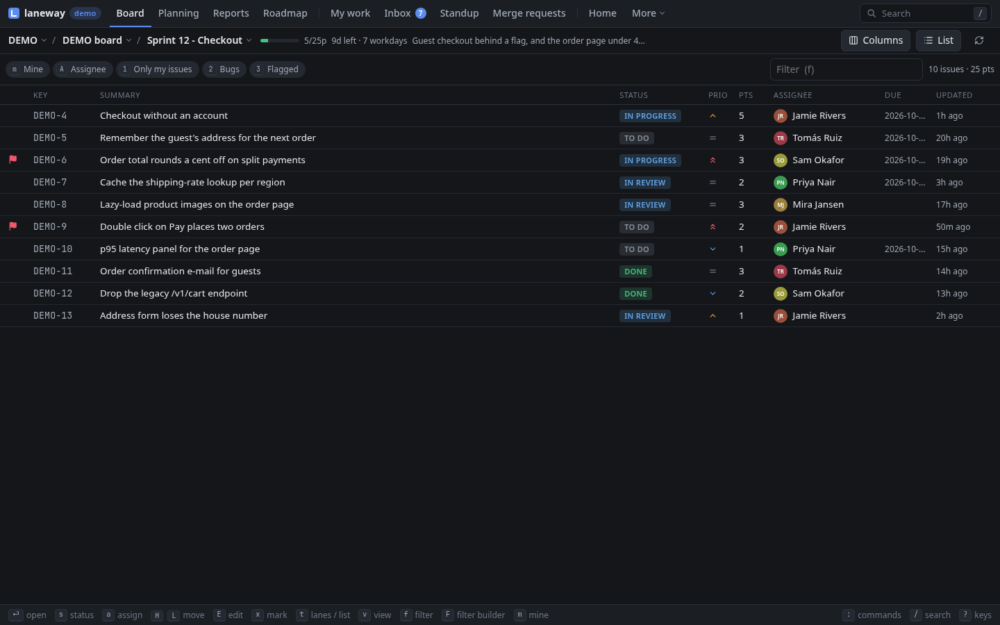

# 1. First run

**In this chapter:** install laneway, give it a Jira token, and get your
team's board on screen. At the end you can find your way around a board
and back out again.

## Install

Pick one:

```sh
brew install cornedor/tap/laneway      # macOS
yay -S laneway                         # Arch (AUR), laneway-git for main
nix run github:cornedor/laneway
go install github.com/cornedor/laneway@latest
```

Or grab a binary from
[Releases](https://github.com/cornedor/laneway/releases) and put it on your
`PATH`. When a newer release is out, `↑ v1.2` shows in the header and the
palette (`:`) has the command that updates it.

## Terminal or browser

One binary, two ways to use it. `laneway` runs in your terminal;
`laneway web` serves the same app to your browser, on
`http://127.0.0.1:8484`. They share the config, so you set up once, and
both can run at the same time.

Throughout this guide, where the two differ you'll see a tab for each.
Pick yours once and every page follows.

**Try it first:** `laneway -demo` or `laneway web -demo` opens a generated
project, with sprints, comments, worklogs and a merge request to review.
No site, no token; move cards and comment all you like, it is gone when you
quit. Most of this guide works on it; git, agents and your own sites need
the real thing.

## Tell it where your Jira is

=== "Terminal"

    Run `laneway`. The first time, it has no config yet, so it asks:

    ```
    Connect laneway to a Jira site, or type demo to try it on a generated board first. ctrl+d cancels.

    Jira site, its name (acme) or URL: acme
      https://acme.atlassian.net
    Email: you@example.com
    API token: make one at https://id.atlassian.com/manage-profile/security/api-tokens
      paste it, or press enter to open that page:
      signing in… ✓ signed in as Ada Lovelace
    Keep the token in the system keyring instead of the config file? [Y/n]

    Saved as jira in ~/.config/laneway/config.yaml.
    ```

    For the token, press `enter` and the page opens: *Create API token*,
    name it "laneway", copy it, paste it back (it isn't shown). laneway
    signs in before it saves anything; a typo says what went wrong and asks
    again, with `enter` keeping what you typed. The keyring question only
    comes where there is one (`secret-tool`, macOS Keychain). Then your
    board opens.

=== "Browser"

    Run `laneway web`. Without a config the browser opens on a setup page:
    your site (`acme` or its URL), email and an API token, with the steps to
    make one. It signs in before it saves anything and says what went wrong
    if it can't.

    Two boxes to tick: keep the token in the system keyring, and start
    `laneway web` when you log in. *Try the demo* starts the generated
    project instead.

The config is plain YAML, readable only by you:
`~/.config/laneway/config.yaml`.

> **Tip:** rather not keep the token in the file or a keyring? Export
> `JIRA_API_TOKEN` first; setup then offers that, and the file gets none.

> **Tip:** add `projects: [ABC]` under `jira:` to put the projects you work
> in at the top of the project picker.

Token expired? `laneway setup` again with the same site replaces the email
and token and leaves the rest of the config alone;
`laneway -site club setup` fills in club's URL for you.

## Your board

laneway opens on a board of the first project in `projects` (or, without
that list, the first project you can see by name): the board's columns side
by side as lanes, one card per issue.

=== "Terminal"

    

    | Key | Does |
    | --- | --- |
    | `p` | pick a project (type to filter) |
    | `b` | pick one of the project's boards |

=== "Browser"

    

    | Key | Does |
    | --- | --- |
    | `alt+p` | pick a project (type to filter) |
    | `B` | pick one of the project's boards |

    Or click the project and board names in the bar above the lanes.

laneway remembers both, so next time it opens right there, from a cached
copy while the fresh one loads.

## Look around

=== "Terminal"

    | Key | Does |
    | --- | --- |
    | arrows or `h` `j` `k` `l` | move between cards and lanes |
    | `[` `]` | the board's views: active sprint, next sprints, backlog |
    | `t` | swap the lanes for a sortable list, and back |
    | `enter` | open the card's issue in a panel beside the board |
    | `esc` | close the panel again |
    | `?` | every key, as bound on your machine |
    | `:` | the palette: every action you can take right now |
    | `q` | quit |

    

    > **Try it:** press `t` for the list, then `s` a few times to sort it by
    > priority, points, assignee… `t` again brings the lanes back.

=== "Browser"

    | Key | Does |
    | --- | --- |
    | arrows or `h` `j` `k` `l` | move between cards and lanes |
    | `[` `]`, `v` | the board's views: active sprint, next sprints, backlog |
    | `t` | swap the lanes for a sortable list, and back |
    | `enter` | open the card's issue in a panel beside the board |
    | `esc` | close the panel again |
    | `?` | the keys you can press right now |
    | `:` | the palette: every command, view and issue |
    | `g` then a letter | another view: `g p` planning, `g r` reports, `M` lists them all |

    The bar at the bottom shows the main keys of what has the focus; a
    click presses one.

    

    > **Try it:** press `t` for the list, then `O` a few times to sort it by
    > priority, points, assignee… `t` again brings the lanes back.

> **Tip:** lost? `?` shows the keys of the screen you are on, and `:`
> finds any action by any word.

## More than one Jira?

Press `@` and pick *add a Jira site*: the same questions, and a name to
pick it by (`club` for club.atlassian.net). It lands under `sites:`, and
laneway opens on it. `@` switches between them after that, and the next
start opens the one you last picked; `laneway -site club` starts on one.
`laneway setup` does the same from the shell.

```yaml
sites:
  club: {base_url: https://club.atlassian.net, email: you@example.com, api_token: ...}
```

## Recap

- `laneway` in the terminal, `laneway web` in the browser, one config.
- The first start asks for your Jira, email and token; `@` adds another
  site.
- Pick a project and board once; `[` `]` views, `t` lanes or list.
- `enter` opens an issue, `esc` closes it, `?` when in doubt.

Next: [The board and the panel](02-board-and-panel.md), where you narrow
the board down and read an issue without opening Jira.
