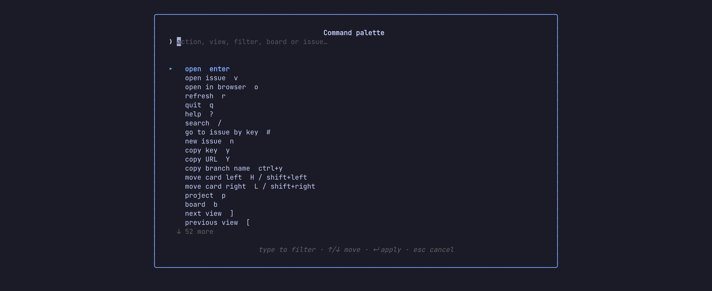

# 2. The board and the panel

**In this chapter:** narrow a busy board down to what matters, and read an
issue (description, comments, links, images) without opening a browser.
Nothing here writes to Jira yet; that's chapter 3.

## Narrow the board

A sprint of sixty cards is a lot. Three ways to see fewer, from quick to
precise.

**Only yours.** `m` toggles "assigned to me". `a` picks anyone else, or
Unassigned.

**Quick filters.** The board's own quick filters sit in the header; `1`–`9`
toggle them, `0` clears every filter at once. Add your own presets under
`ui.quick_filters` in the config and they come first.

**Search.** `/` narrows the loaded cards as you type, without asking Jira
again. Plain words match the key, summary, assignee or epic; `field:value`
terms get specific, and every term must hold:

```
/login                  text anywhere on the card
/status:review          a field containing a value
/assignee:ada,bob       any of several values
/points>2 prio>=high    numbers and priorities compare
/age>3d is:flagged      in progress over 3 days, and flagged
/-label:ui              any term negated
```

> **Try it:** `/age>3d` on your active sprint. Whatever is left has been
> sitting in progress for more than three days: a good standup topic.

> **Tip:** can't remember the fields? `F` opens the filter builder: pick a
> field, a comparison and a value from lists, and it writes the `/` query
> for you. Each term shows as a chip in the header; a click removes it.

## Arrange it

- `t` swaps lanes and list. In the list, `s` steps the sort: rank,
  priority, points, assignee, epic, key, status, updated, due, created.
  Sorting by assignee, priority, epic or status groups the rows.
- In lanes, `s` groups them into swimlanes by assignee, epic or priority.
  `z` folds the band under the cursor, `Z` unfolds them all.

laneway remembers the mode and swimlanes per board.

## Open an issue

`enter` on a card opens its issue in the panel on the right; `tab` moves
the keys between the board and the panel. The panel shows the fields at the
top, then the description, links, subtasks, attachments and the activity.


In the panel:

| Key | Does |
| --- | --- |
| `j` `k`, `space` / `b`, the wheel | scroll a line, a page |
| `tab` / `shift+tab` | walk the fields |
| `[` `]` | activity tabs: comments, history, work log, all |
| `L` | pick a linked issue, subtask, the parent or a web link to open |
| `N` | your private notes on it, a file on this machine (`$EDITOR`) |
| `ctrl+a` | ask `ui.llm` (`claude -p` by default): a summary, acceptance criteria, subtasks, points |
| `/` | find text in the issue; `n` / `N` step through the hits |
| `backspace` | back to the issue you came from |
| `i` | the issue's images full size (in kitty or Ghostty) |
| `o` | open it in the browser |
| `y` / `Y` | copy the key / the URL |
| `ctrl+y` | copy a branch name for it |
| `esc` | close the panel |

> **Try it:** open an issue with links, press `L` and follow one. Follow
> another from there. The trail shows at the top of the panel; `backspace`
> walks it back, one issue at a time.

> **Tip:** `<` widens the panel and `>` narrows it, or drag its left border
> with the mouse. laneway remembers the width. Drag over the panel's text
> to select it; letting go copies it.

## Go anywhere

- `#` jumps to any issue by key, or by a pasted Jira URL.
- `:` opens the command palette: every action of the pane you are in, the
  board's views and quick filters, the loaded issues and the ones you opened
  lately. Type any words to filter. From three letters it also searches all
  of Jira and the issues laneway has read before, in every project, also
  offline; those hits come last, marked `⌕`.
- `*` pins an issue. Pinned ones come first in the palette.
- `ctrl+t` shows the board as it was: `←` `→` a day at a time, `esc` back.
- Start laneway in a git branch named after an issue (`issue/ABC-12-fix`)
  and it opens that issue; `⎇ ABC-12` in the header opens it again.



> **Try it:** press `:` and type `sprint`. You'll see the views, any issue
> with "sprint" in it, and the actions whose name says sprint, all in one
> list.

## Recap

- `m`, `a`, `1`–`9`, `0` and `/` narrow the board; `F` builds a `/` query.
- `t` lanes or list, `s` sort or swimlanes.
- `enter` opens an issue, `L` follows links, `backspace` comes back.
- `#` goes to a key, `:` goes to anything, `ctrl+t` goes back in time.

Previous: [First run](01-first-run.md) · Next:
[Editing and moving](03-editing-and-moving.md)
