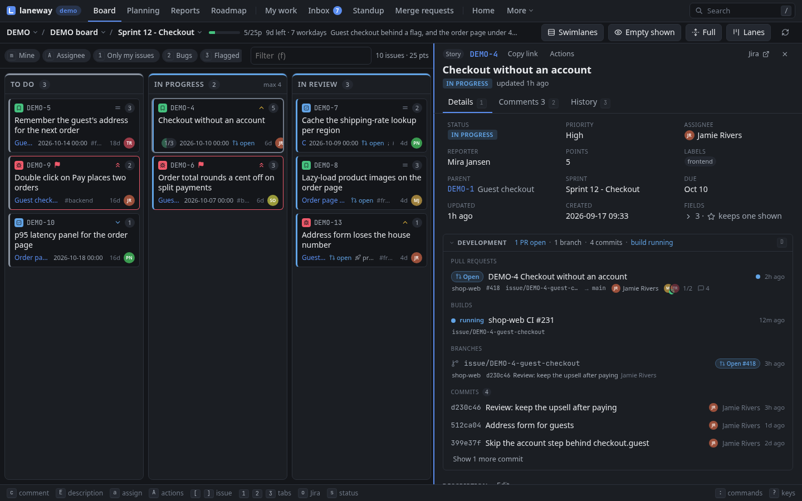
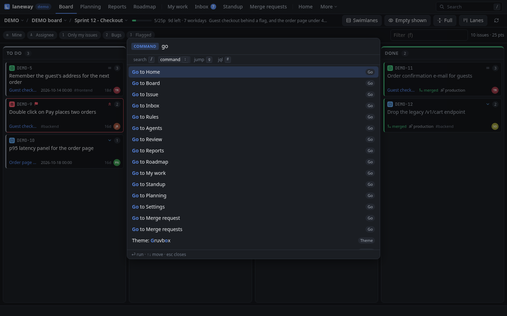

# 2. The board and the panel

**In this chapter:** narrow a busy board down to what matters, and read an
issue (description, comments, links, images) without opening Jira.
Nothing here writes to Jira yet; that's chapter 3.

## Narrow the board

A sprint of sixty cards is a lot. Three ways to see fewer, from quick to
precise.

**Only yours.** `m` toggles "assigned to me". The assignee filter picks
anyone else, or Unassigned, and ticks several at once.

**Quick filters.** The board's own quick filters sit above the cards;
`1`–`9` toggle them, `0` clears every filter at once. Add your own presets
under `ui.quick_filters` in the config and they come first.

**Search.** The board's search narrows the loaded cards as you type,
without asking Jira again. Plain words match the key, summary, assignee or
parent; `field:value` terms get specific, and every term must hold:

```
login                  text anywhere on the card
status:review          a field containing a value
assignee:ada,bob       any of several values
points>2 prio>=high    numbers and priorities compare
age>3d is:flagged      in progress over 3 days, and flagged
-label:ui              any term negated
```

The [search reference](../reference/search.md) has every field.

=== "Terminal"

    | Key | Does |
    | --- | --- |
    | `m` | mine |
    | `a` | assignee filter: `space` or `tab` ticks several, `enter` applies |
    | `1`–`9`, `0` | quick filters, clear all |
    | `/` | search |
    | `F` | filter builder |

=== "Browser"

    | Key | Does |
    | --- | --- |
    | `m` | mine |
    | `A` | assignee filter: `tab` or `space` ticks several |
    | `1`–`9`, `0` | quick filters, clear all |
    | `f` | search (the Filter box) |
    | `F` | filter builder |

> **Try it:** search `age>3d` on your active sprint. Whatever is left has
> been sitting in progress for more than three days: a good standup topic.

> **Tip:** can't remember the fields? `F` opens the filter builder: pick a
> field, a comparison and a value from lists, and it writes the query for
> you. Each term shows as a chip; a click removes it.

## Arrange it

- Lanes or a list: `t` swaps them. The list sorts by rank, priority,
  points, assignee, epic, key, status, updated, due or created; by
  assignee, priority, epic or status it groups the rows.
- In lanes the same key groups them into swimlanes by assignee, epic or
  priority. `z` folds the band under the cursor, `Z` unfolds them all.
- `c` makes cards one line high.
- `alt+e` hides lanes the filters leave empty, so the rest get the room.
  Moving a card into one shows it again. `ui.empty_lanes: hide` starts
  that way.
- `alt+l` switches to your own lanes (`ui.lane_layouts`, drawn by
  dragging columns in the browser's settings): Test, UAT and Deploy
  stacked under Done, columns reordered, renamed or hidden. Again
  goes on to the next layout, then back to the board's columns. `z`, or
  a click on a stacked column's header, folds it; `Z` unfolds them all.

=== "Terminal"

    `s` steps the sort, or the swimlanes. A folded column keeps its header
    in place, with a ▸.

=== "Browser"

    `O` steps the sort, or the swimlanes; in the list `C` picks the
    columns, and a click on a column header sorts by it. Folded stacked
    columns line up under the lane's head; a click unfolds one.

laneway remembers the mode and swimlanes per board.

## Open an issue

`enter` on a card opens its issue in the panel on the right; `tab` moves
the keys between the board and the panel. The panel shows the fields at the
top, then the description, links, subtasks (an epic's child issues, with
how many are done), attachments and the activity.

=== "Terminal"

    

    | Key | Does |
    | --- | --- |
    | `j` `k`, `space` / `b`, the wheel | scroll a line, a page |
    | `tab` / `shift+tab` | walk the fields |
    | `[` `]` | activity tabs: comments, history, work log, all |
    | `L` | open a linked issue, subtask, child, the parent or a web link |
    | `backspace` | back to the issue you came from |
    | `N` | your private notes on it, a file on this machine (`$EDITOR`) |
    | `ctrl+a` | ask `ui.llm` (`claude -p` by default): a summary, acceptance criteria, subtasks, points |
    | `/` | find text in the issue; `n` / `N` step through the hits |
    | `i` | the issue's images full size |
    | `o` | open it in the browser |
    | `y` / `Y` / `ctrl+y` | copy the key / the URL / a branch name |
    | `esc` | close the panel |

    In kitty or Ghostty images show inline in the panel (inside tmux, with
    `set -g allow-passthrough on`); elsewhere as a caption, and `i` opens
    them. `ui.images: off` turns them off.

=== "Browser"

    

    | Key | Does |
    | --- | --- |
    | `1` `2` `3` | tabs: details, comments, history (`3` again: work log, all) |
    | `j` `k` | the next, previous comment |
    | `G` | go to a linked issue, subtask, child, the parent or a web link |
    | `backspace` | back to the issue you came from |
    | `[` `]` | the previous, next issue of the list you came from |
    | `N` | your private notes on it, edited in place |
    | `ctrl+a` | ask `ui.llm` (`claude -p` by default): a summary, acceptance criteria, subtasks, points |
    | `/` | find text in the issue; `n` / `N` step through the hits |
    | `i` | the issue's images, larger |
    | `o` | open it in Jira |
    | `y` / `Y` / `ctrl+y` | copy the key / the link / a branch name |
    | `esc` | close the panel |

    The panel owns the keys while it has the focus: its edge lights up and
    the board's cursor greys. A palette row (`ctrl+enter`) opens an issue as
    a page of its own.

Private notes are a plain file beside the state file
(`notes/ABC-12.md`), shared by both; `is:notes` finds the issues that have
them, and they post as a comment when you want to share them (`A` in the
terminal, a button under the notes in the browser).

> **Try it:** open an issue with links and follow one. Follow another from
> there. The trail shows at the top of the panel; `backspace` walks it back,
> one issue at a time.

> **Tip:** `<` widens the panel and `>` narrows it, or drag its left
> border. laneway remembers the width.

## Go anywhere

- `:` opens the palette: every action you can take, the board's views and
  quick filters, the loaded issues and the ones you opened lately. Type any
  words to filter. From three letters it also searches all of Jira.
- `*` pins an issue. Pinned ones come first in the palette.
- The time machine shows the board as it was, a day at a time.
- The closed sprint view shows a past sprint as it closed, with what was
  done and where the rest carried over to.

=== "Terminal"

    | Key | Does |
    | --- | --- |
    | `#` | go to an issue by key, or a pasted Jira URL |
    | `ctrl+t` | time machine: `←` `→` a day, `esc` back |
    | `ctrl+o` | a closed sprint |

    The palette also searches every issue laneway has read before, in
    every project, offline too; those hits come last, marked `⌕`.

    Start laneway in a git branch named after an issue (`issue/ABC-12-fix`)
    and it opens that issue; `⎇ ABC-12` in the header opens it again.

    

=== "Browser"

    | Key | Does |
    | --- | --- |
    | `g g` | go to an issue by key, or a pasted Jira URL |
    | `alt+t` | time machine: `←` `→` a day, `esc` back |
    | `alt+o` | a closed sprint |

    The palette's first character picks what it searches: `:` commands,
    `/` issues, `#` JQL. Started in a git branch named after an issue, its
    first row is `⎇ ABC-12`.

    

> **Try it:** press `:` and type `sprint`. You'll see the views, any issue
> with "sprint" in it, and the actions whose name says sprint, all in one
> list.

## Recap

- `m`, the assignee filter, `1`–`9`, `0` and search narrow the board; `F`
  builds a query.
- `t` lanes or list; sort, swimlanes and `c` one-line cards.
- `enter` opens an issue, links lead on, `backspace` comes back.
- `:` goes to anything; the time machine goes back in time.

Previous: [First run](01-first-run.md) · Next:
[Editing and moving](03-editing-and-moving.md)
