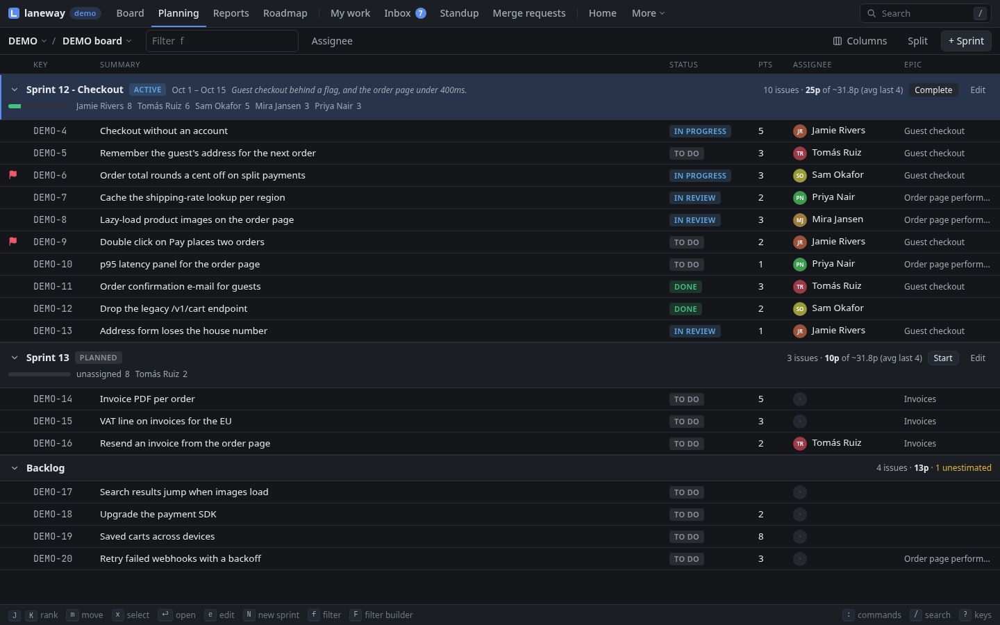
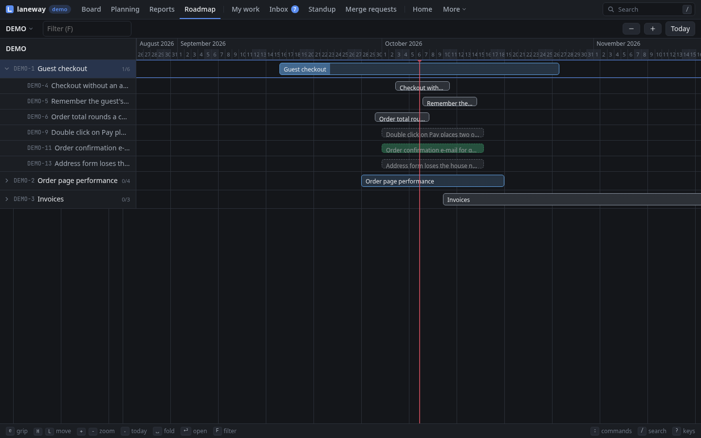
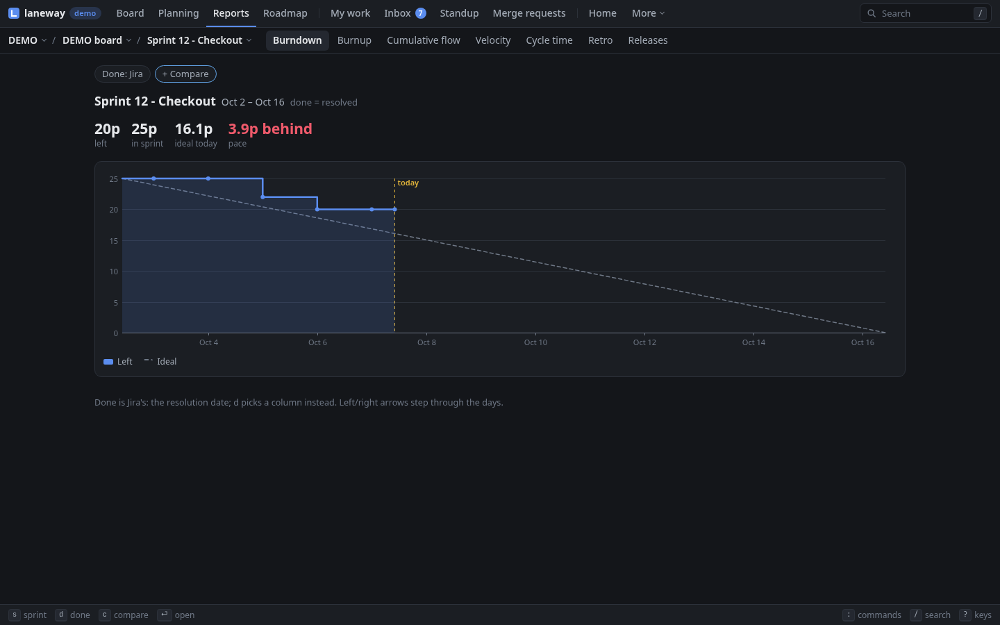
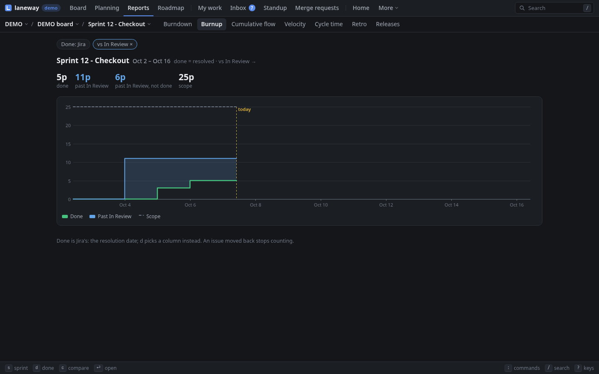

# 4. Planning and reporting

**In this chapter:** step back from single cards. Fill a sprint against
everyone's capacity, see epics on a timeline, read the burndown and ship a
release.

> **Kanban board?** Planning and the sprint charts need a scrum board with
> sprints; the roadmap, cycle time and releases work on any. A kanban
> board hides work done more than two weeks ago, like Jira does
> (`ui.kanban_done_days`).

## Plan a sprint

The backlog and the sprints side by side, each counting its cards and
points. A sprint also splits them per person, against `ui.capacity`, and
weighs its points against what the last sprints got done (`10p of ~12p`,
marked over when it is more). Move cards across, rank them, start and
complete sprints. Changes show at once and are written behind.

=== "Terminal"

    `P` on the board puts the backlog on the left and a sprint on the
    right (the first future one; `[` `]` pick another). `esc` goes back.

    

    | Key | Does |
    | --- | --- |
    | `←` `→` | switch side |
    | `x` | mark cards |
    | `M` or `space` | move the marked (or the selected) card across |
    | `K` `J` | rank up or down |
    | `S` | start the sprint on the right (today until the day you type, `+2w` by default) |
    | `N` | a new sprint, named on from the last one |
    | `R` / `E` | rename it / edit its goal |
    | `C` twice | complete the active sprint; unfinished work moves to the next one |
    | `y` | copy the sprint as a markdown table |
    | `/`, `F` | filter both sides, filter builder |
    | `e` / `B` | quick edit the card / the marked ones |
    | `u` | undo the last move across |

=== "Browser"

    `g p` lists the active and future sprints and the backlog as sections,
    each foldable (`z`). `|` splits the screen, a sprint kept beside the
    list, and `>` sends a card there. Drag rows across; marked rows go
    together.

    

    | Key | Does |
    | --- | --- |
    | `x` or `space` | select cards |
    | `m` | move the selected (or the current) card to a sprint or the backlog |
    | `J` `K` | rank down or up |
    | `[` `]` | the previous, next sprint |
    | `Z` | start the sprint |
    | `N` | a new sprint |
    | `E` | its name, goal and end in one form |
    | `C` | complete the active sprint; unfinished work moves on |
    | `y` | copy the section as a markdown table |
    | `f`, `F`, `A` | filter, filter builder, assignee filter |
    | `e` / `X` | quick edit the card / the selected ones |

> **Tip:** tell laneway how many points each person takes on:
>
> ```yaml
> ui:
>   capacity: {Ada: 13, default: 10}
> ```
>
> A person over capacity turns red (`Ada 15/13!`). With `ui.calendar` set,
> your meetings in the sprint come off yours: a sprint with a quarter of its
> hours in meetings leaves you three quarters.

### Refine: `ctrl+e`

`ctrl+e` steps through the open issues on screen (the search and filters
apply), one at a time in a wide panel, the ones without points first: set
points, priority, labels, status, or split one into subtasks. `J` goes to
the next, `K` back; `esc` ends it and copies what you changed, for the
meeting notes.

## See the roadmap

The project's epics on a timeline, in rank order: a bar from start to due
date (or Plans' target dates), filled by points done, else by children
done. Epics without dates span their children's sprints, drawn fainter.
Resolved epics stay for 90 days (`ui.roadmap_done_days`). Epics with a
parent (an initiative) sit under it.

=== "Terminal"

    `R` on the board.

    

=== "Browser"

    `g m`.

    

- `←` `→` scroll, `+` `-` zoom (a day to two weeks per column), `.` back to
  today.
- `space` folds an epic's issues out, `enter` opens one.
- `H` `L` move a bar, `<` `>` move its end; `e` grips its start, again its
  end, again lets go. Or drag a bar, or either end, with the mouse. The new
  dates go to Jira once you pause.
- `E` quick edits the row's issue, `n` makes a new epic, `f` shows an
  epic's issues as a board view, `y` copies the roadmap as a table.

=== "Terminal"

    `/` narrows the roadmap to the epics, and children, that match; `u`
    puts the last moved bar back.

=== "Browser"

    `F` narrows the roadmap to the epics, and children, that match.

> **Tip:** a `⛓` on an epic means another open epic blocks it. It turns red
> `⛔` when that blocker ends after this one starts.

## Read the charts

The active sprint's burndown (points left per day, against the ideal
line), its burnup and cumulative flow, the velocity of the last 8 closed
sprints (`ui.velocity_sprints`). *Cycle* plots the issues done in the
last 8 weeks by how long they took, with the 50th and 85th percentile, and
lead time the same. *Retro* sets the last closed sprint beside the one
before: committed, added, done, carried over, moved backwards, and which
issues. `y` copies the open chart's numbers as a markdown table.

The burndown counts an issue from the day it joined the sprint and says how
much was added after the start; its title says whether the sprint is
ahead, behind or on track. No story points in your team? The burndown and
burnup count issues instead.

=== "Terminal"

    `C` on the board; `tab` steps through the charts, `d` and `c` set the
    lines.

    

=== "Browser"

    `g r` opens Reports; `1`–`7` (or `h` `l`) pick burndown, burnup,
    cumulative flow, velocity, cycle time, retro or releases. `s` picks
    another sprint, `W` the cycle-time window, `d` and `c` the lines (also
    the buttons above the chart). Hover a chart for its numbers.

    

### Where done is

By default done is Jira's: the resolution date, usually the board's last
column. Your work may end sooner: when a customer accepts or a release goes
out is not up to you. `d` picks the column done counts from instead; that
column and every one right of it count (In review counts what is in
review, accepted or done). It is kept per board in `ui.report_done`.

`c` puts a second line beside it while you look, say Done beside In
review: the burndown and burnup draw both with the gap shaded, flow marks
them, cycle time splits each issue at the left one (how long to build,
how long to get through review), and the retro lists what got past one
but not the other. Velocity and releases keep Jira's done.



An issue moved back before the line stops counting (`ui.report_backwards:
first` keeps counting it from its first crossing).

## Ship a release

The project's versions, newest first, each with a bar of its issues done
and its release date. Open one to see its issues as a view; release an
unreleased one today. Set an issue's fix version in the panel, among its
other fields.

=== "Terminal"

    `V` lists them; `enter` shows a version's issues. The `↳ release` row
    under an unreleased one releases it on a second `enter`, saying how
    many of its issues are not done yet.

=== "Browser"

    `V` on the board, or the Releases report (`g r` then `7`). `enter`
    shows a version's issues on the board, `r` releases it.

## Recap

- Planning: the backlog beside the sprints, capacity per person; start and
  complete sprints there.
- `ctrl+e` refines whatever is on screen, one issue at a time.
- The roadmap: epics on a timeline, dragged or moved with `H` `L`.
- Charts for the sprint, cycle time and the retro, counting done where you
  say; releases.

Previous: [Editing and moving](03-editing-and-moving.md) · Next:
[Your day](05-your-day.md)
