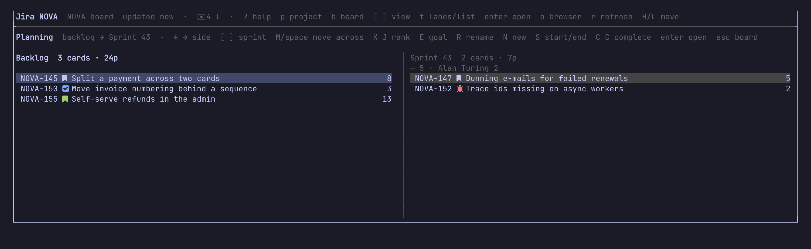
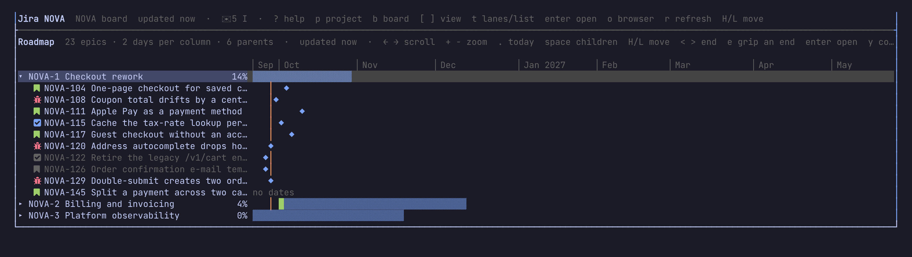
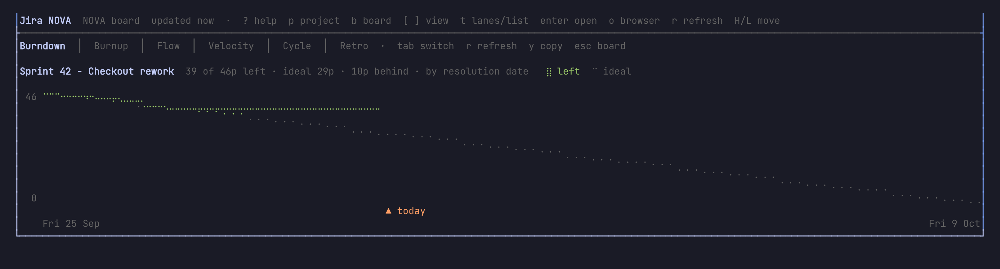
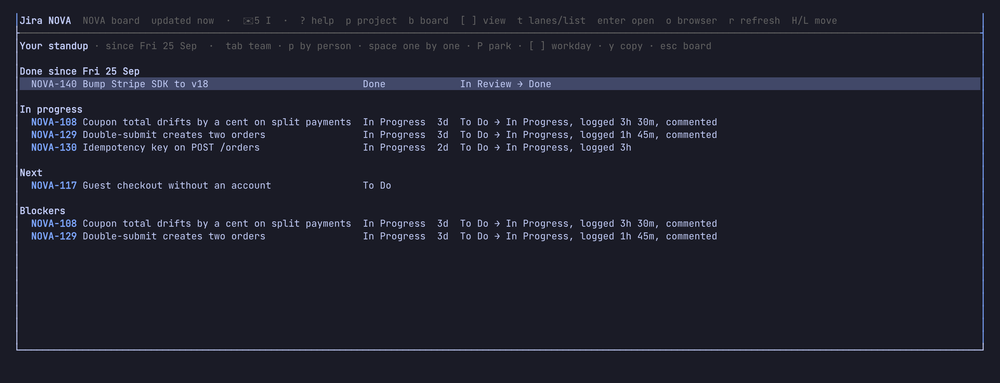
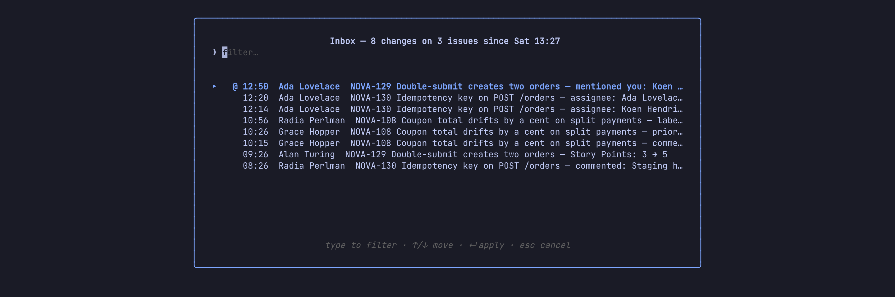
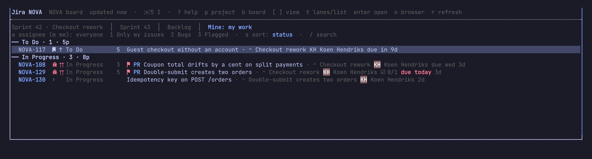

# 4. Planning, roadmap, charts and your time

**In this chapter:** step back from single cards. Fill a sprint against
everyone's capacity, see epics on a timeline, read the burndown, and keep
track of your own day. Each of these is one key from the board; `esc` (or
`q`) brings you back.

## Plan a sprint: `P`

On a board with sprints, `P` puts the backlog on the left and a sprint on the
right (the first future one; `[` `]` pick another). Each side counts its
cards and points; the sprint also splits them per person.



| Key | Does |
| --- | --- |
| `←` `→` | switch side |
| `x` | mark cards |
| `M` or `space` | move the marked (or the selected) card across |
| `K` `J` | rank up or down |
| `S` | start the sprint on the right (today until the day you type, `+2w` by default) |
| `N` | a new sprint, named on from the last one |
| `R` / `E` | rename it / edit its goal |
| `C` twice | complete the active sprint; unfinished work moves to the next one |
| `y` | copy the sprint as a markdown table |
| `/` | filter both sides; `esc` clears it |
| `e` / `B` | quick edit the card (points, status, assignee…) / the marked ones |
| `u` | undo the last move across |

With the mouse, drag a card to the other side. Changes show at once and are
written behind.

> **Tip:** tell laneway how many points each person takes on:
>
> ```yaml
> ui:
>   capacity: {Ada: 13, default: 10}
> ```
>
> A person over capacity turns red and gets a `!` (`Ada 15/13!`).

> **Try it:** open `P` before your next planning meeting, mark the top
> backlog items with `x` until someone hits their limit, and `M` them into
> the sprint.

### Refine the backlog: `ctrl+e`

On the backlog view, `ctrl+e` shows its issues one at a time, the ones
without points first, in a wide panel: set points (`P`), priority, labels,
status, or split one into subtasks (`A`). `J` goes to the next, `K` back;
`esc` ends it and copies what you changed, for the meeting notes.

## See the roadmap: `R`

`R` shows the project's epics on a timeline: a bar from start to due date,
filled by how much is done. Epics without dates span their children's
sprints, drawn fainter.



- `←` `→` scroll, `+` `-` zoom (a day to two weeks per column), `.` back to
  today.
- `space` folds an epic's issues out, `enter` opens one.
- `H` `L` move a bar, `<` `>` move its end, or drag it with the mouse. The
  new dates go to Jira once you pause.
- `n` makes a new epic, `f` shows an epic's issues as a board view.

> **Tip:** a `⛓` on an epic means another open epic blocks it. It turns red
> `⛔` when that blocker ends after this one starts.

## Read the charts: `C`

On a board with sprints, `C` draws the active sprint: burndown, burnup,
cumulative flow, the velocity of the last sprints, and how long work takes
(cycle and lead time, with the 50th and 85th percentile). *Retro* compares
the last sprint with the one before, for the retrospective. `tab` steps through
them; `y` copies the open chart's numbers as a table.



> **Tip:** no story points in your team? The burndown and burnup count
> issues instead.

## Ship a release: `V`

`V` lists the project's versions with how much of each is done. `enter`
shows one's issues as a view; the `↳ release` row under an unreleased one
releases it today, on a second `enter`. Set an issue's fix version in the
panel, with its other fields.

## Your day

### Log work

`w` in the panel logs time on the issue: `1h 30m fixed the flaky test`
(also `1.5h`, `45m`, `2d`). It ends now, unless you put a day first:
`yesterday 2h`, `fri 1h`, `2026-09-21 3h`. It comes off the issue's
remaining estimate; add `left:2h` to say what's left instead.

### The timer

`T` starts a timer on the card or issue you're on; it shows in the header
and survives a restart. `T` again stops it into the same log input, filled
in with the time.

> **Try it:** `T` on the card you're about to work on. When you're done,
> `T` again, type what you did, `enter`. Your time is logged.

### Today's work: `W`

`W` lists what you logged today, with the total. `[` `]` step a day, `e`
edits an entry, `d` twice deletes it, `y` copies the day as a table.


`W` again shows the whole week as a grid, an issue per row and a day per
column, with the totals and how short each workday is of 8h. `enter` on an
empty cell logs work there.

> **Try it:** on Friday, `W` `W`, fill the gaps, `y`, paste it into the
> time registration.

### Standup: `U`

`U` lists what you did since the previous workday (Friday, on a Monday):
status changes, comments, logged work and, with `jira.repos` set, your
git commits, by day. Its first row, *Copy as text*, puts it on the
clipboard grouped per issue.



Running the standup? Its *Team* row lists what each person on the board
did and logged since the last workday.

> **Try it:** `U`, `enter` on *Copy as text*, paste it in your team's
> standup channel. Done before the coffee's ready.

### Inbox: `I`

`I` lists what others did on your issues since you last looked: field
changes and comments, mentions of you first, marked `@`. The header shows
`✉ 3` when there's something new.



### My work: `O`

`O` shows what's assigned to you in every project, open or done this week,
grouped by status.



### Your git

`ctrl+r` shows the issues whose pull or merge requests wait on your review.
In a repository, `laneway hook install` puts the branch's key in your
commit messages, and `laneway prompt` prints the branch's issue, the timer
and the inbox count for your shell prompt or tmux status line. See the
[reference](../reference.md#git-and-your-shell).

## Recap

- `P` planning, `R` roadmap, `C` charts, `V` releases; `esc` back to the board.
- `w` logs work, `T` times it, `W` shows the day, `W` again the week.
- `U` writes your standup (its *Team* row everyone's), `I` shows what others
  did, `O` shows all your work, `ctrl+r` what waits on your review.

Previous: [Editing and moving](03-editing-and-moving.md) · Next:
[Rules, JQL, keys and themes](05-rules-jql-keys-themes.md)
