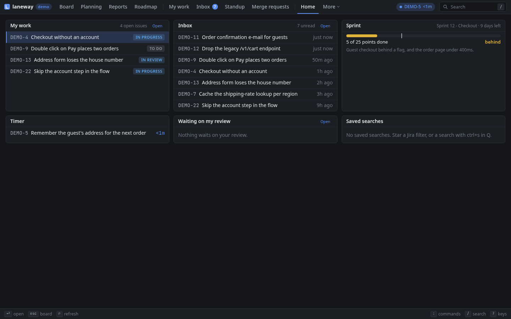
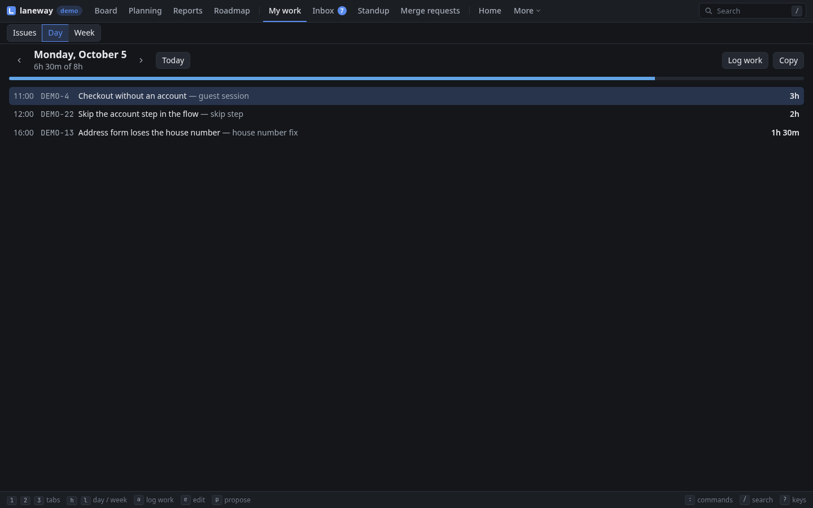
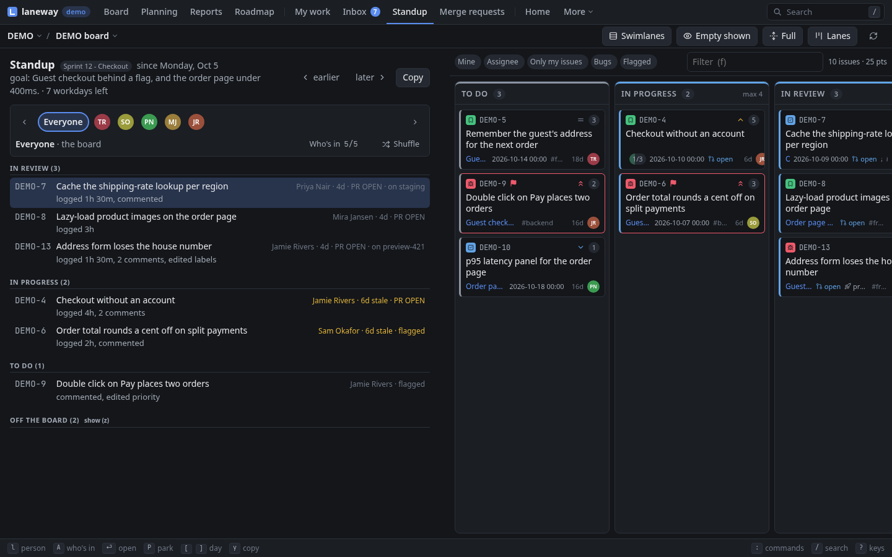
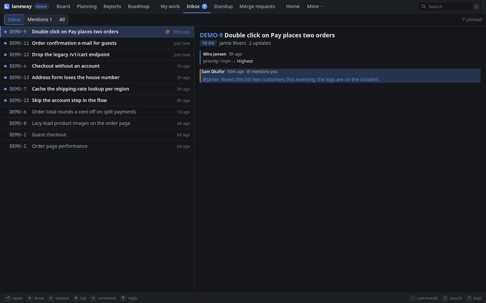
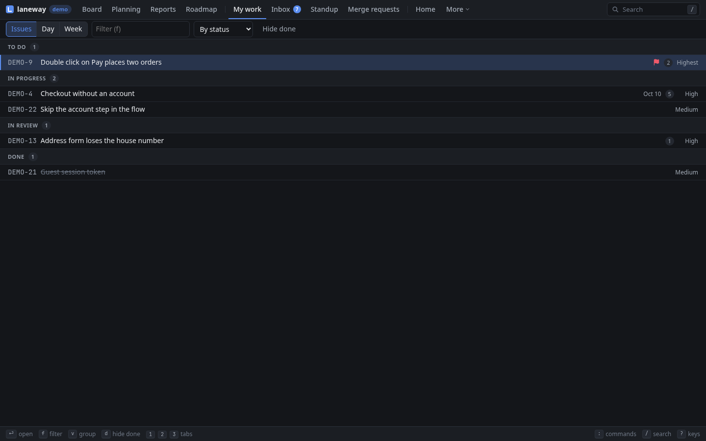

# 5. Your day

**In this chapter:** start the day on one screen, log your time without a
spreadsheet, run the standup, and see what others did on your issues while
you were busy.

## Home

Your day on one screen: your open work, unread inbox threads, the sprint
(done against the time gone, *behind* when it trails), the running timer
and a count per saved search. `enter` opens the
row; on a heading, its own screen. To start every day there:

```yaml
ui:
  home: [work, inbox, sprint, timer, filters]   # any of them, in your order
```

=== "Terminal"

    `~` opens it.

=== "Browser"

    `g h` opens it.

    

## Log work

`w` logs time on the issue: `1h 30m fixed the flaky test` (also `1.5h`,
`45m`, `2d` of 8h). It ends now, unless you put a day first: `yesterday
2h`, `fri 1h`, `2026-09-21 3h`, `-2d 1h`; that day's work starts at
`ui.workday_start` (09:00). It comes off the issue's remaining estimate;
add `left:2h` to say what's left instead, `left:keep` to leave it.

## The timer

`T` starts a timer on the card or issue you're on; it shows in the header
and on the card (`⏱ 12m`) and survives a restart. `T` again stops it into
the same log input, filled in with the time and when it started.
`ui.timer_round: 15m` rounds it up. `T` on another card logs this one and
starts timing that one.

=== "Terminal"

    In the stop input, `ctrl+d` drops the timer unlogged (twice after five
    minutes), and `ctrl+t` moves the timer to the card you're on, its time
    with it.

=== "Browser"

    The running timer sits in the bar on top; a click stops it.

> **Try it:** `T` on the card you're about to work on. When you're done,
> `T` again, type what you did, `enter`. Your time is logged.

## Your worklogs

What you logged on a day, with the total; edit an entry's time and
comment, delete one, copy the day as a markdown table. *Propose* fills the
gaps: your commits and branch switches in the `jira.repos` repositories,
the lines `ui.activity` commands print (agent logs, shell history), each
issue's time less what it has logged, rounded to a quarter. Point
`ui.calendar` at your calendar (an `.ics` URL or file, or khal's vdir) and
set `ui.meeting_key` to the issue you book meetings on, and each meeting
that day is proposed too, its title as the comment. Log a proposal and it
is logged from its start.

The week shows as a grid, an issue per row and a day per column, with the
totals and how short each past workday is of 8h. Log on any cell.

=== "Terminal"

    `W` lists today. `[` `]` step a day, `e` edits an entry, `d` twice
    deletes it, `p` proposes, `enter` logs a proposal, `y` copies.

    

    `W` again shows the week: `[` `]` step a week, `enter` logs on a cell,
    `#` adds a row for an issue you haven't logged on yet.

=== "Browser"

    `W` opens My work on the day. `h` `l` step a day, `0` back to today,
    `e` edits an entry, `d` deletes it, `p` proposes, `enter` logs a
    proposal, `a` logs work, `y` copies.

    

    `W` again (or `3`) shows the week: `h` `l` step a week, `enter` logs on
    a cell, `+` adds a row for another issue.

> **Try it:** on Friday, open the week, fill the gaps, `y`, paste it into
> the time registration.

## Standup

The standup since the previous workday (Friday on a Monday;
`ui.standup_lookback` reaches further), over the sprint goal and the
workdays left. A strip on top goes round the people: *Everyone* first,
then each assignee on the board in the order the walk meets them, the one
shown named, those heard ticked, someone without activity marked *no
changes*.

- *Everyone* walks the board right to left, closest to done first: each
  card in progress with who has it, how long (*stale* past
  `ui.stale_days`), a flag, what blocks it, its pull request or deploy, and
  what happened since (`To Do → Done, logged 2h, 2 comments`), or *no
  activity*.
- A person's stop is their cards and those they did something on; yours
  adds your commits in the `jira.repos` repositories.
- *Off the board*, folded, has what was done on the project's other
  issues.
- Park a card for after the standup: the *Parking lot* comes last on
  Everyone, kept for the sprint.

Pick who takes part, kept per board: on a big project the board's
assignees are more than the team. With `ui.standup_timer: on`, a timer
starts with the first person: each turn counts down `ui.standup_length`
(15m) split over those taking part, or `ui.standup_timebox`, red once it
runs out. It never moves on by itself.

=== "Terminal"

    `U` swaps the board for it. `←` `→` go round the people, `a` picks who
    takes part, `s` shuffles, `space` starts or pauses the timer, `P`
    parks a card, `z` folds out Off the board, `[` `]` step a workday,
    `enter` opens the issue, `y` copies the stop as text, `esc` goes back.

    

=== "Browser"

    `U` (or `g s`) opens it with the board beside it, on the same view,
    past a grip like the panel's. The board's assignee filter follows the
    person shown, and picking someone in it goes to their stop. `h` `l` go
    round the people, `A` picks who takes part, `s` shuffles, `space` the
    timer, `P` parks a card, `z` Off the board, `[` `]` step a workday, `y`
    copies.

    

> **Try it:** start the standup with your team, go round with `→`, and park
> anything that turns into a discussion.

## Inbox

What others did on the issues you watch, are assigned or reported, in the
last week, on every site you added: one thread per issue, unread marked
`●`, mentions first, each in full beside the list with what's new marked.
Another site's threads say so, and open in Jira.

Each thread keeps its own marks. Showing it reads it; `u` makes it unread
again. `e` marks it done: off the list until something new happens. `E`
does that for every read thread. `s` snoozes it till the next workday.
`c` comments, `R` replies to its newest comment, `o` opens it in Jira.
The unread count shows on top, and a new mention raises a notification.

=== "Terminal"

    `I` opens it; `tab` switches Inbox · Mentions · All. The header shows
    `✉ 3`; the notification goes through the terminal (kitty, Ghostty,
    WezTerm, foot).

    

=== "Browser"

    `I` (or `g i`) opens it; `1` `2` `3` or `tab` switch Inbox · Mentions ·
    All. The count shows on the Inbox tab and the app's badge; mentions
    become browser notifications once you allow them.

    

## My work

What's assigned to you in every project, open or done this week, grouped
by status. `ui.my_work_jql` changes what it asks.

=== "Terminal"

    `O` opens it.

    

=== "Browser"

    `O` (or `g w`) opens it; `v` groups by status, project or nothing, `d`
    hides what's done.

    

## Recap

- Home is your day on one screen; `ui.home` starts there.
- `w` logs work, `T` times it, `W` shows the day (propose fills the gaps,
  meetings included) and the week.
- `U` runs the standup, round the team, with a timer if you want one.
- `I` shows what others did, `O` all your work.

Previous: [Planning and reporting](04-planning-and-reporting.md) · Next:
[Work on an issue](06-work-on-an-issue.md)
