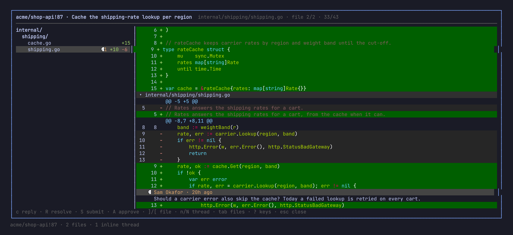
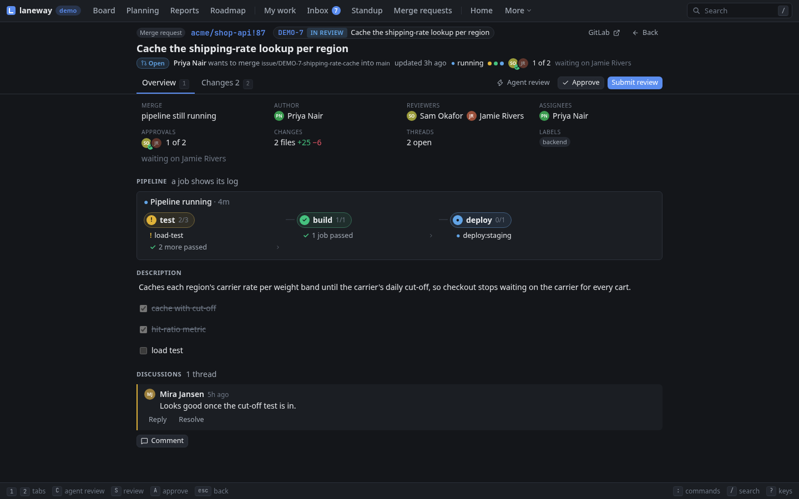
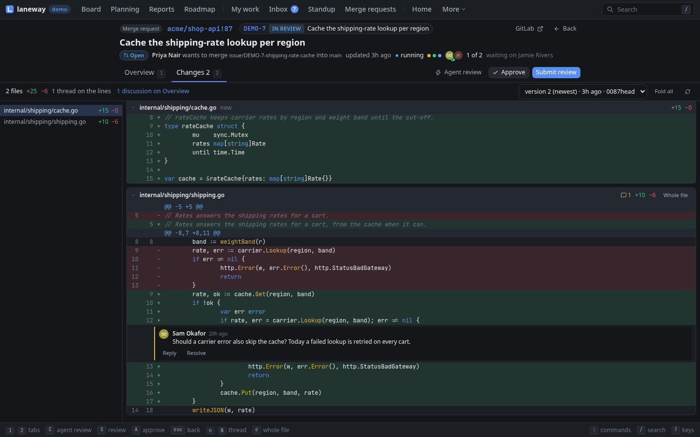

# 6. Work on an issue

**In this chapter:** take an issue from the board to a merged pull request:
a branch, commits that name it, a coding agent if you like, a draft pull
request, and the merge requests waiting on you. Most of this needs a real
repository; the demo has a merge request to review.

## Tell laneway where the code is

Map each project to its checkout:

```yaml
jira:
  repos: {ABC: ~/src/abc}
```

That one line feeds most of this chapter, and your commits into the
standup and the worklog proposals. In the browser, everything here runs on
the machine `laneway web` runs on.

## A branch for the issue

`ctrl+y` on a card or in the panel copies a branch name for it
(`ABC-12-login-fails`; `ui.branch_template` shapes it). Start laneway
inside a branch named after an issue and it offers that issue: the
terminal opens it, the browser's palette lists it first.

## Commits that name the issue

In the repository, once:

```sh
laneway hook install
```

From then on a commit on `issue/ABC-12-fix` that names no issue gets the
key in front: `fix it` becomes `ABC-12 fix it`. A branch without a key
refuses the commit; merges, reverts and fixups pass. `-strict` also
refuses keys Jira doesn't know. Checking out an issue's branch while it's
still to do asks `move ABC-12 (To Do) to In Progress? [y/N]`.

## Start work with an agent: `S`

With [herdr](https://herdr.dev) running, `S` on an issue starts work: the
issue's worktree opens as a herdr workspace with a coding agent in it. One
form shows the agent (those on your `PATH`, `ui.work_agent` first), the
branch and the prompt (`jira.start_prompt`), all filled in and editable;
`enter` starts it. An empty prompt starts the agent without one. Without
herdr, the terminal says it needs herdr and the browser hides it.

Starting can do more, each off until you turn it on:

```yaml
ui:
  start_assigns: on           # assign the issue to you
  start_status: In Progress   # and move it there
  timer_on_start: on          # and start the timer
jira:
  start_statuses: {ABC: Doing, OPS: ""}   # per project, over ui.start_status
```

With any of them on, the form has an **Also** row listing them, ticked;
untick them for this start.

While it runs, its card shows how it's doing, with a notification when it
waits on you:

| Mark | Means |
| --- | --- |
| `⚙` | working |
| `✋` | waiting on you |
| `✓` | done, not looked at yet |
| `○` | idle |
| `◌` | a worktree without an agent |

The panel lists the issue's agents: send one a prompt, stop it, or start
another in the same worktree.

=== "Terminal"

    `S` again, a click on the card's mark, or the agent's row in the panel
    attaches to its terminal; herdr's `ctrl+b q` detaches. Rather keep the
    board in sight? `ui.agent_view: panel` puts the agent in the panel, and
    `ctrl+\` goes back to the issue. Inside herdr it focuses the agent's
    pane instead.

=== "Browser"

    `ctrl+\`, or `4` in the panel, opens the agent's terminal in the
    panel's Terminal tab, drawn by xterm.js; every key goes to the agent
    until `ctrl+\` hands them back. `alt+s` starts another agent in the
    worktree. A click on the card's mark opens Agents.

> **Try it:** `S` on a small bug, pick your agent, `enter` on the empty
> prompt. Go back to the board and watch its card turn `✋` or `✓`.

## All your agents

Every agent on an issue, grouped by state, the ones waiting on you first,
each with its issue's summary and status, whichever site it's on. Beside
the list, the cursor's agent's own terminal, live. `enter` types into it,
`ctrl+\` goes back to the list. `v` opens the issue, `p` sends a prompt,
`d` twice stops it, `tab` adds the worktrees without an agent. The header
counts the agents waiting and working; a click opens the list.

=== "Terminal"

    `ctrl+g`.

=== "Browser"

    `ctrl+g` or `g a`. `z` makes the terminal full size, `t` takes input
    over from another window attached to the same agent, `f` focuses it in
    herdr, `N` starts another in its worktree. `ctrl+shift+c` copies, and
    `shift`+drag selects while the program has the mouse.

## Open a pull request

The issue's actions (`A`) → *Open a pull request* pushes the issue's
branch and opens a draft, titled with the key and summary and linking the
issue: `gh` for a GitHub origin, `glab` otherwise. `D` in the panel lists
it, with its builds, deployments, branches and commits. Without Jira's
GitLab integration, laneway finds the merge requests whose title names the
issue's key. Cards show the state (`pr` in `ui.card_fields`), and the
search `pr:open` finds the ones with an open one.

Once it's merged, *Remove its worktree* in the same actions removes the
checkout. Uncommitted changes keep it; the branch stays.

## Review a merge request

The merge requests waiting on you on every GitLab you're signed in to
(`gitlab:` in the config, or a `glab auth login`): review asked, assigned,
or yours with comments you haven't read, Jira key or not. Each shows its
state, pipeline by stage with its jobs' logs, approvals and who they wait
on, your pending notes and the description; its diff has the threads under
their lines.

- Notes go into your pending review, which only you see until you submit
  it: comment, approve or request changes, with a summary. Or just
  approve.
- Mark a range of lines for a note, or suggest a change.
- `C` hands the review to your `ui.work_agent`, in a worktree of the source
  branch. Its findings land in your pending review, for you to edit, drop
  or submit.
- `n` `N` step through threads, `e` shows the whole file, `v` an earlier
  push.
- `M` merges it: squashed or not, the branch deleted or kept, GitLab's
  defaults first.
- Edit it: title, draft or ready, reviewers and assignees from the
  project's members (one of each on GitLab's free tier), labels, target
  branch, description.
- A merge request on a GitLab without a token says how to sign in: `glab
  auth login --hostname <host>`, or a personal access token with scope
  `api` under `gitlab:` in the config. Reload once signed in; no restart.

=== "Terminal"

    `alt+m` lists them; `enter` reads one in the panel, `i` the Jira issue
    it names, `p` its pipeline's jobs (`enter` a job's log, followed while
    it runs), `e` what to edit, the description in `$EDITOR`. `d` opens
    the diff over the screen, files on the left.

    

    In the diff, `c` writes a note on the line or a reply on a thread, `V`
    marks a range first, `s` suggests a change. `E` rewords a pending note,
    `x` drops it, `R` resolves a thread. `S` submits, `A` approves, `M`
    merges.
    `]` `[` change file, `?` lists the rest. Leaving with unsubmitted notes
    says so.

=== "Browser"

    `g M` lists them; `enter` opens a merge request's page: *Overview*
    (`1`) with the pipeline, the job logs and the discussion, *Changes*
    (`2`) with the diff. `i` shows the Jira issue beside it. A click on
    the title or a field edits it, `e` lists what can change.

    

    In the diff, a click on a line number writes a note there, `shift`+click
    marks a range. Suggest, edit, drop, reply and resolve are buttons. `S`
    submits, `A` approves, `M` merges, `j` `k` change file.

    

## Recap

- `jira.repos` maps a project to its checkout.
- `ctrl+y` a branch name, `laneway hook install` keys in commits.
- `S` starts an agent in a worktree, the card shows its state; its
  terminal is a key away.
- All your agents in one list, each one's terminal beside it.
- `A` → pull request, `D` lists it, `A` → remove the worktree.
- Merge requests waiting on you: the pipeline, the diff, notes and a
  review to submit.

Previous: [Your day](05-your-day.md) · Next:
[From the shell](07-from-the-shell.md)
