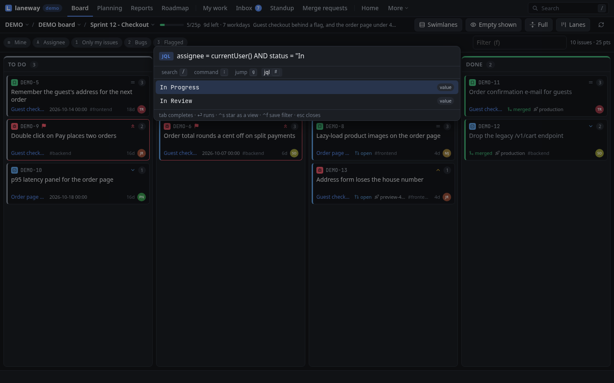
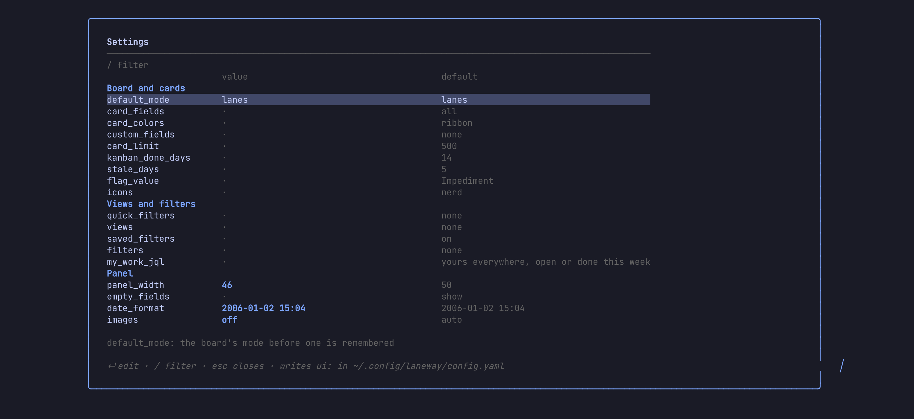
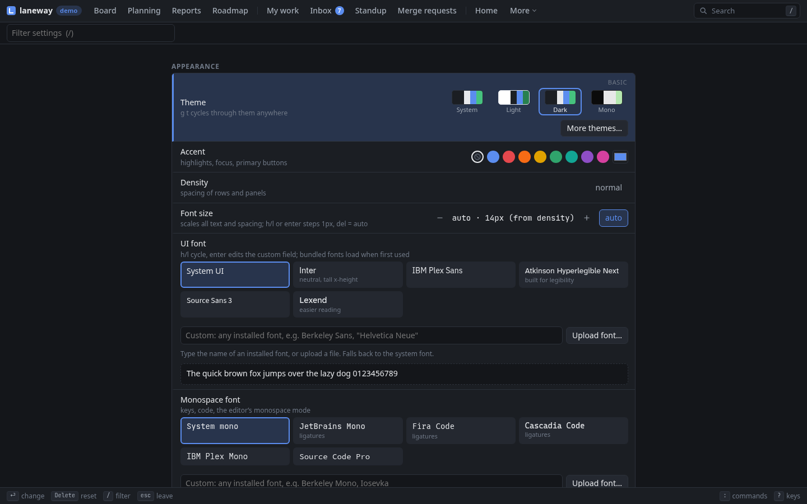

# 8. Make it yours

**In this chapter:** make laneway work for you. Search all of Jira with
JQL, keep your favourite searches one key away, let rules watch for
changes, and bend the cards, lanes, keys and colours to your taste. It ends with
what to check when something looks off.

## JQL: `Q`

The board's search only narrows the cards already loaded. `Q` asks Jira
itself: type JQL, `enter`, and the results show as a view like any other.
It completes fields, functions and keywords as you type, and a field's
values after an operator.

- `ctrl+s` stars the query: it becomes a view (`★ …`) on every board.
- `ctrl+f` saves it as a real Jira filter under a name you type, to share
  or subscribe to in Jira. Your starred Jira filters show as views too
  (`ui.saved_filters: off` hides them).

=== "Terminal"

    `tab` takes a suggestion, `↑` `↓` choose. An empty input offers your
    past searches; `ctrl+s` on a starred one unstars it.

    

=== "Browser"

    `Q` opens the palette in JQL mode; `tab` takes a suggestion.

    

> **Try it:** `Q`, then `assignee = currentUser() AND updated >= -7d`,
> `enter`. Everything of yours that moved this week, on one board. Like it?
> `ctrl+s`.

> **Tip:** views you always want can live in the config too:
>
> ```yaml
> ui:
>   views:
>     - {name: Mine, jql: "assignee = currentUser()"}
>   filters:                      # named board searches, found in the palette
>     - {name: Stale review, query: "status:review age>3d"}
> ```

## Rules

Rules react to what changed on the board since the last refresh: a new
issue, or a status, assignee, priority, points or summary change. They
live under `rules:` at the top of the config, and run in the terminal and
in `laneway web` alike.

A rule that tells you when a bug is done:

```yaml
rules:
  - name: done-bugs
    on: status
    match:
      type: Bug
      status: Done
    actions:
      - type: notify
        title: "{{.Key}} done"
```

What a rule can do:

| Action | Does |
| --- | --- |
| `notify` | a desktop notification (the terminal's, or the browser's) |
| `highlight` | a ● on the card until you open it |
| `log` | a line in `~/.config/laneway/rules.log` |
| `exec` | runs a command, with the issue as JSON on stdin |
| `transition` | moves the issue along its workflow |
| `comment` | posts a comment |

`transition` and `comment` write to Jira, so they only fire on changes
someone else made, never on yours and never on their own writes. A rule
with `watch:` follows its own JQL instead of the board, polled every
`every:`. The [rules reference](../reference/rules.md) has the rest.

### Test before you trust

=== "Terminal"

    ```sh
    laneway rules list                                    # what loaded
    laneway rules test -on status -type Bug -status Done  # what would fire, and why not
    ```

=== "Browser"

    `g l` opens Rules: what loaded, a live feed of what fired, and *Try a
    change* (`t`), a form that says which rules a change fires and what
    stopped the rest. `N` turns on browser notifications for `notify`.

> **Try it:** add the `done-bugs` rule above and try a change to Done on a
> Bug. It shows `done-bugs` firing, and for every other rule what stopped
> it.

## Keys

Every action can be rebound.

=== "Terminal"

    In the config, to one key or several:

    ```yaml
    ui:
      keys:
        search: ctrl+f
        mine: [m, M]
    ```

    The names are in the [reference](../reference/terminal-keys.md#rebinding).
    laneway warns when one key does two things on the same screen, and `?`
    always shows the keys as you bound them.

=== "Browser"

    Settings › Keyboard: `enter` on an action captures a new key, kept per
    site. `ui.keys` from the config applies too, where the browser has the
    same action; a remap in Settings wins.

## Your own actions

A command of yours can sit in the palette, and on a key:

```yaml
ui:
  actions:
    - {name: copy for the changelog, key: "!", command: [sh, -c, 'jq -r "\(.key) \(.summary)" | wl-copy']}
```

It gets the issue (or the marked cards) as JSON on stdin and `LANEWAY_KEY`
in its environment; its last line shows as a message. In the browser it
runs on the machine `laneway web` runs on.

## Your cards

`ui.card_fields` picks what a card shows and in what order; leave out what
you don't use. Your own Jira fields join by name:

```yaml
ui:
  card_fields: [type, priority, points, assignee, due, age]
  custom_fields: [Team, Test type]
```

Custom fields show on cards and rows and are searchable:
`"test type":e2e`.

`ui.card_layout` places lane cards' fields yourself: `top` and `bottom` are
the lines around the summary, each with a `_right` side. Any field of
`card_fields` goes, plus `key`, `labels` and your custom fields by name.
List rows keep `card_fields`.

`ui.card_styles` restyle the cards a board search matches: a coloured
`edge`, a `tint`, `fade`, a `bold` summary, fields to `hide`, or fields to
`show` only on a match. A later match wins.

```yaml
ui:
  card_layout:
    top: [type, key, flagged]
    top_right: [status, points]
    bottom: [parent, due, labels]
    bottom_right: [age, avatar]
  card_styles:
    - {when: "prio>=high", edge: err, bold: true}
    - {when: "age>5d -is:done", tint: warn}
    - {when: "is:done", fade: true}
    - {when: "due<7d", show: [due]}
```

Colours are `accent`, `ok`, `warn`, `err`, `info` (the theme's) or
`#rrggbb`. In the browser, Settings › Board and cards has a designer for
both: drag fields onto a card, add styles, and see sample cards change as
you go. The terminal draws the result too.

## Your lanes

`ui.lane_layouts` put your own lanes over a board's columns: Test, UAT and
Deploy stacked under Done, columns reordered, renamed or hidden. Nothing
changes in Jira. Arrange one with `alt+L` in the terminal, or by dragging
in the browser's Settings; `alt+l` switches between them.
[Arrange it](02-board-and-panel.md#arrange-it) shows them on the board,
[Lane layouts](../reference/config.md#lane-layouts) the config.

## Settings

Every `ui:` option by topic, with its value and default, and what the
selected one does; `/` filters them. Change one and it is checked, written
back to the config file (your comments kept) and applied at once. The
[configuration reference](../reference/config.md) lists them all.

=== "Terminal"

    `,` opens them. `enter` edits one, or picks from its values when it has
    a fixed set (`icons`, `theme`, …).

    

    > **Try it:** `,`, `/panel_width`, `enter`, set it to `40`. The panel
    > resizes as you press `enter`.

=== "Browser"

    `g ,` (or `,`) opens them, beside the browser's own: Appearance,
    Keyboard, Notifications and App. `enter` or `space` changes a row, `h` `l` step its
    values, `delete` resets it. `quick_filters`, `views` and `my_work_jql`
    get a JQL editor: a name and a query per row, completions as you type,
    and how many issues each finds.

    

## Look

=== "Terminal"

    Start from a preset and change what you like:

    ```yaml
    ui:
      theme:
        preset: tokyonight   # catppuccin, gruvbox, dracula, nord, onedark, rosepine, kanagawa, … light ones too
        accent: "#7aa2f7"
        dim: "244"
    ```

    Colours take ANSI numbers (`0`–`255`) or `#rrggbb`; the
    [reference](../reference/config.md#terminal-theme) lists the presets
    and colour names. On a font without Nerd Font glyphs, `ui.icons: plain`
    draws issue types as letters. `theme: mono`, or `NO_COLOR` in your
    environment, uses no colour.

=== "Browser"

    Settings › Appearance: the theme (system, light, dark, nord, gruvbox,
    solarized, tokyonight, catppuccin, dracula, onedark, rosepine, kanagawa,
    monokai, most with light and dark variants, or mono), accent, density,
    font size, motion, the key bar, and your own CSS tokens as JSON:

    ```json
    {"--bg": "#101010", "--radius": "2px"}
    ```

    `g t` cycles the theme; the palette lists them as `Theme: …`. Fonts:
    the interface's and the code's, your own families or uploaded files,
    ligatures and line height. Look is kept in the browser; fonts on the
    server, per site.

## When something looks off

=== "Terminal"

    | You see | Try |
    | --- | --- |
    | Boxes or `?` for issue types | `ui.icons: plain`, or a Nerd Font |
    | No images in tmux | `set -g allow-passthrough on` in `tmux.conf` |
    | Your terminal can't select text | `ui.mouse: off` leaves the mouse to it |
    | A message flashed by | the palette's `messages` row lists the last ones |
    | Sign-in fails after months | the token expired: `laneway setup` again |
    | Requests time out on a slow site | raise `jira.timeout` (`20s` by default) |
    | A rule doesn't fire | `laneway rules test` says what stopped it |

=== "Browser"

    | You see | Try |
    | --- | --- |
    | The page doesn't load | is `laneway web` running? `laneway web` again opens the one that is |
    | No notifications | allow them: Settings › Notifications, or `N` in Rules |
    | Sign-in fails after months | the token expired: `laneway setup` again |
    | Requests time out on a slow site | raise `jira.timeout` (`20s` by default) |
    | A rule doesn't fire | *Try a change* in Rules (`g l`) says what stopped it |

## Where to next

- `?` in any screen for its keys, `:` for anything you can't find.
- The [reference](../reference/index.md) for every option, search term and
  key.
- The [releases](https://github.com/cornedor/laneway/releases) for what
  just landed.

Previous: [From the shell](07-from-the-shell.md) ·
Next: [In the browser](09-in-the-browser.md)
