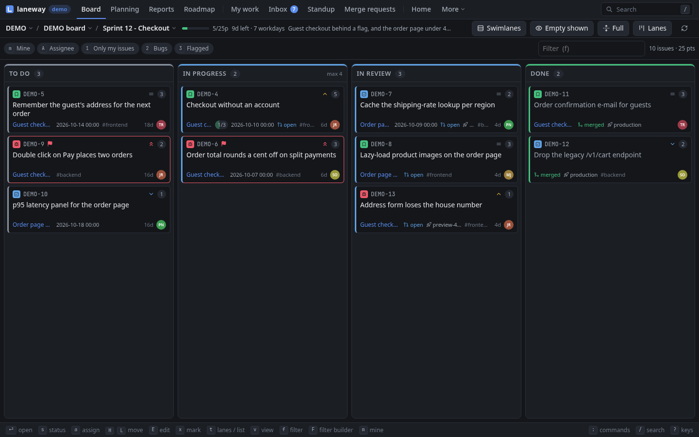

# 9. In the browser

**In this chapter:** run `laneway web` for good: start it at login, find
your way around its layout, put it on your phone, and know what it does
differently from the terminal and how it keeps your Jira safe.

## Start it

```sh
laneway web                  # http://127.0.0.1:8484, opens your browser
laneway web -demo            # a generated project, no Jira needed
laneway -site club web       # another site from sites:
laneway web -addr 127.0.0.1:9000 -no-open
```

`serve` is an alias. It is the same binary and the same config as the
terminal version: nothing to install, no second login. `ctrl+c` in the
terminal stops it. A `laneway web` started while one already runs on the
address opens that one.

| Flag | |
| --- | --- |
| `-addr` | address to listen on, `127.0.0.1:8484` by default |
| `-remote` | allow an address that is not loopback (see [Security](#security)) |
| `-no-open` | don't open the browser |
| `-demo` | serve a generated project instead of Jira; your config's `ui:` and `rules:` still apply |

`-site` and `-config` are the global flags and go before `web`.

## Start at login

Tick it on the setup page, or toggle it under Settings › App. It installs a
user service, no root: a systemd user unit
(`~/.config/systemd/user/laneway-web.service`) on Linux, a LaunchAgent
(`~/Library/LaunchAgents/com.github.cornedor.laneway.web.plist`) on macOS,
running `laneway web -no-open` on the same address and config with your
shell's `PATH`. It takes effect at the next login. Not with `-demo` or
`-remote`.

## The layout



- **App bar** (on top): the site (`@` switches with several `sites:`), the
  views, the tray, search. Views that don't fit fold into **More**; `M`
  lists every view with its key, Rules and Settings among them.
- **Tray:** only what needs you: offline, queued writes, agents waiting or
  working, the running timer, a newer release.
- **Context bar** (under it): where you are (project, board, sprint) and
  how you look at it (filters, modes). Views without controls have none.
- **Key bar** (at the bottom): the main keys of what has the focus, the
  panel's or the view's, as bound; a click presses one. Messages show in
  it. Hidden on phones; Settings › Appearance turns it off.
- After `g` a card lists the keys that can follow.

| View | Key | |
| --- | --- | --- |
| Home | `g h` | your day on one screen; the start page with `ui.home` |
| Board | `g b` | lanes or list, filters, drag and drop |
| Planning | `g p` | the backlog and sprints, start and complete |
| Reports | `g r` | burndown, burnup, cumulative flow, velocity, cycle time, retro, releases |
| Roadmap | `g m` | epics on a timeline |
| My work | `g w` | your issues, worklogs of a day or week, proposals |
| Inbox | `g i` | threads on issues others changed, mentions |
| Standup | `g s` | round the team, with the board beside it |
| Agents | `g a` | coding agents and worktrees, each one's live terminal (needs herdr) |
| Review | `g R` | pull and merge requests waiting on your review (needs `gh` or `glab`) |
| Merge requests | `g M` | the ones waiting on you on your GitLabs, a page each |
| Rules | `g l` | your rules, a live feed, try a change |
| Settings | `g ,` | every `ui:` option, appearance, keys |

`tab` moves focus between the view and the panel; the focused panel owns
the keys, and its digits are its tabs. Every key is in
[Browser keys](../reference/browser-keys.md).

## Phone and notifications

The page is an installable app (PWA): the shell is cached by a service
worker, Jira's answers never are. A new version shows an *Update ready*
message. On a phone, a long press on a card opens its menu as a sheet.

Browser notifications are off until you allow them (Settings ›
Notifications, or `N` in Rules). Then a mention in your inbox, an agent
waiting on you and a rule's `notify` raise one; unread inbox threads show
on the app's badge.

## What differs from the terminal

Most of laneway works the same in both, on the same config. The guide's
tabs show where keys and screens differ; beyond that:

- **No local index.** The browser reads through the server from Jira; the
  palette doesn't search issues read before, and nothing answers offline.
  Writes still wait in the queue while Jira is unreachable, as long as the
  server runs.
- **Images** draw in the page, at any size; `i` opens a viewer.
- **Private notes** edit in the panel, not in `$EDITOR`; the files are the
  same.
- **Fields** edit with a click; there is no key to walk them.
- **Review notes** in a merge request's diff take the mouse: a click on a
  line number.
- **A screenshot of a region** can't be attached from the browser; paste or
  drop the image instead.
- **Settings** add the browser's own look: themes, fonts, density. Key
  remaps made there are kept per site, not in `config.yaml`.
- **Agents' terminals** are the same `herdr agent attach`, drawn by
  xterm.js. A second window on the same agent takes it over; the first
  says so. The browser keeps `ctrl+w`, `ctrl+t` and `ctrl+n` unless
  laneway runs as an installed app.
- Agents, review and actions need herdr, `gh`, `glab` and your commands on
  the server's machine, as in the terminal.

Both can run at once; a change made in one shows in the other on the next
refresh.

## Security

- It listens on loopback only. `-addr` with another address is refused
  unless you pass `-remote`.
- There is no login. Whoever reaches the port acts as you on Jira.
- It is also a shell: `ui.actions` and `ui.llm` run commands on the
  machine, and so can whoever drives the page. Never expose it publicly.
- The agents' terminal is shell access: typing into a coding agent is
  running commands as you. It attaches to herdr agent panes only, never an
  arbitrary shell, and never in the demo. A terminal closes after 30
  minutes with nothing either way and reconnects after 8 hours (access
  checked again); closing it detaches, the agent keeps running.
- The `Host` header must be a loopback name (or the address it was told to
  listen on), so a DNS-rebound page can't reach it. A write, and any
  `/api/` request with an `Origin`, must come from the page's own origin;
  cross-site requests are refused, WebSockets included.
- `-remote` also needs the launch token: open the URL it prints, with
  `?token=`, which sets a cookie; requests without it get 401. Use it on a
  network you trust, or behind a tunnel that authenticates.

## Tips

- Views draw from the last answer at once and refresh behind it; the
  issues around the board's cursor load ahead.
- Long lists are virtual: only what you see is drawn, so a 1000-card limit
  is fine.
- Moves and edits show at once and roll back with a message if Jira says
  no.
- `r` (`R` in planning, reports, the roadmap and rules) refreshes;
  *Reload data* in the palette drops every cached answer.
- `laneway web -demo` is a safe place to learn the keys.

Previous: [Make it yours](08-make-it-yours.md) ·
Back to the [start](README.md)
